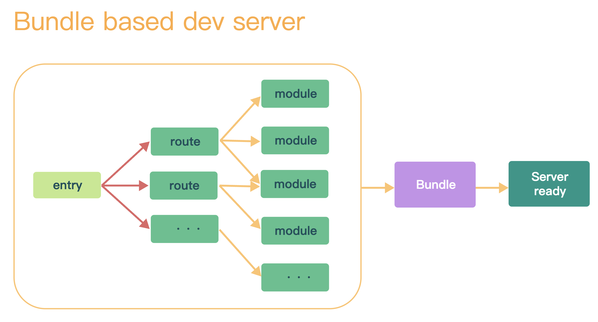
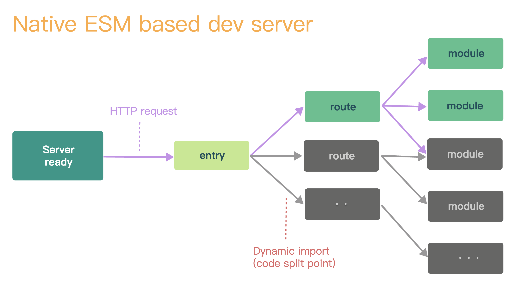
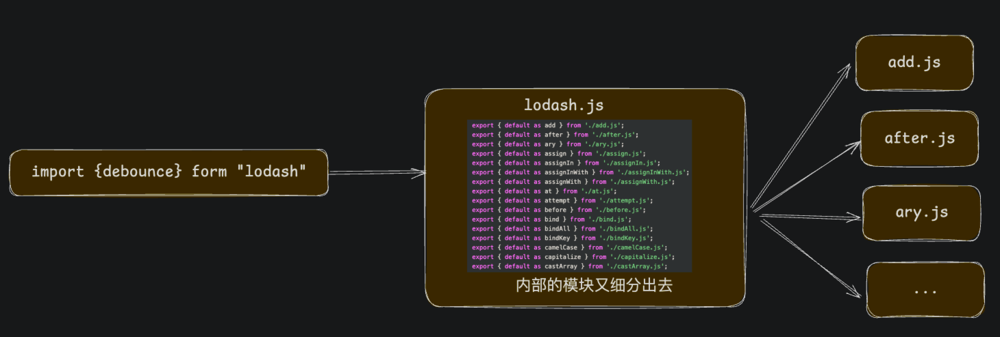

Vite 是什么？是脚手架工具？还是打包构建工具？

要解释这个问题，我们需要先明白什么是脚手架工具，什么是构建工具。

+ 脚手架：帮助我们快速搭建开发环境的项目代码的工具；

+ 构建工具：将代码从开发环境构建到生产环境；

<br />

先来看下构建工具的发展过程：

+ 第一代：以`npm scripts`、Grunt、Gulp 为代表的构建工具，这一代构建工具所做的事情主要就是编译、合并和压缩等工作；

+ 第二代：以 Browserify、Webpack、Parcel、Rollup 为代表的构建工具。这一代构建工具加强了对模块化的处理，能够对模块化的依赖关系进行处理，对模块进行合并打包；

+ 第三代：主要是往“绣化”的方向去发展，也就是使用 Rust 将前端工具链全部重构一遍；

    - Babel ==> SWC

    - PostCSS ==> LightningCSS

    - Eslint ==> Dprint

    - Webpack ==> Turbopack、Rspack

    - Rollup ==> Rolldown

<br />

脚手架的发展：

+ Vue CLI：内置了 Webpack 作为构建工具，专为 Vue 应用服务；

+ Create React APP：内置了 Webpack 作为构建工具，专为 React 应用服务；

<br />

如今，脚手架和构建工具的界限越来越模糊了，一般可以认为构建工作是脚手架里面的一部分。

Vite 也是这种情况：

+ 脚手架：可以搭建各种各样的项目（例如 Vue、React、Sevlte、Solid）；

+ 构建：包括两个构建工具。Esbuild 用于测试环境，Rollup 用于生产环境；

:::tip
Vite 为什么要内置两个构建工具？

Vite 的原话是这么说的：Vite 目前的插件 API 与使用 Esbuild 作为打包器并不兼容。尽管 Esbuild 速度更快，但 Vite 采用了 Rollup 灵活的插件 API 和基础建设，这对 Vite 在生态中的成功起到了重要作用。

<br />

Vite 主要使用 Esbuild 主要是进行开发环境的依赖预构建。
:::

## Vite 的核心原理

Vite 的初衷是为了提升开发体验，那么使用 Webpack 的痛点在哪里？

+ 配置复杂；

+ 构建大型应用项目的时候非常的慢，因为启动项目的时候会先对整个项目进行打包，然后再启动开发服务器运行打包的结果；

    - 

<br />

Vite 是如何解决这个问题的呢？

+ Vite 完全跳过了打包这个过程，直接启动一个开发服务器，然后再利用浏览器的 import 机制按需获取内容；

    - 

+ 当浏览器请求的是 .vue 这样的非 JS 文件，Vite 会进行托管并把 Vue 文件编译为浏览器可以运行的文件；

    - 
+ 关于热更新的实现则利用的是的 Websoket 来实现的；

## 配置文件

任何的工程化工具都应该支持用户进行自定义的配置，Vite 也不例外。

在项目的根目录下新建一个 vite.config.js 文件，基本格式如下：

```javascript
export default {
  // 配置项
};
```

Vite 的配置文件还支持 TS 的类型提示，可以使用 Vite 的一个函数来替换上面的写法：

```javascript
import { defineConfig } from 'vite';

export default defineConfig({
  // 配置选项
})
```

<br />

Vite 的配置可以分为下面几个分类：

+ 普通配置：配置项目的基本内容，别名、根目录、插件...

+ 开发服务器配置：代理、CORS...

+ 构建配置：构建生产版本的行为，端口、主机名...

+ 依赖优化配置：针对依赖预打包的配置，新增包或者排除包...

+ SSR 配置：服务端渲染相关的配置

+ Worker 配置：Web Worker 相关的配置

<br />

具体详见：[配置 Vite](https://cn.vitejs.dev/config/)

## 依赖预构建

Vite 中另外一个重要的概念就是「依赖预构建」。

什么是预构建？

一句话总结：当首次启动 Vite 项目的时候，Vite 会把项目的依赖（node_modules）预先构建一次。

<br />

前面不说 Vite 相比 Webpack 的优点就是不进行打包吗？这里的预构建是什么？

首先要了解一下不进行预构建的问题：

+ 某些依赖可能还是以 CommonJS 的格式发布的，不兼容 ESM；

+ 依赖的文件太多，导致请求太多；

例如当源代码依赖了 lodash 这个包，这个时候浏览器就会发起一次请求，但是 lodash.js 文件内又把具体的模块细分了出去，大约有 600 个文件，那么浏览器就会再次发起 600 个请求。



<br />

为了解决上面的两个问题，Vite 在第一次启动项目的时候会针对依赖进行一个预构建（打包）的过程。

预构建阶段使用的打包工具是 Esbuild，这是一个使用 Go 语言编写的构建工具，效率极高，大部分工作都是并行处理的。Esbuild 能够迅速的将依赖转换为有效的 ESM 模块格式并进行打包，从而优化依赖管理和加载效率。

预构建完成后，浏览器发起一次请求只加载 lodash.js 一个文件就可以了。因为 Esbuild 所做的事情是：

+ 转换：将非 ESM 的模块代码转换为 ESM 的模块格式；

+ 打包：针对依赖进行打包，减少浏览器在开发环境的请求次数；

+ 最小化和压缩：针对代码的最小化和压缩；

<br />

Esbuild 预构建完成的包是会被缓存的：

+ 文件缓存

+ 浏览器缓存

当预构建完成后会讲构建的产物存放在 node_modules/.vite 目录下面，只有下面情况发生的时候才会重新执行预构建：

+ 包管理器的锁文件（package-lock.json、yarn.lock 等）发生变化；

+ 补丁文件夹的修改时间发生了变化；

+ vite.config.js 中的相关字段发生了变化（配置文件中也可以配置针对预构建行为的配置）；

+ `NODE_ENV`的值的变化；

<br />

另外，已经预构建的依赖在浏览器请求后也会被缓存。会使用 HTTP 请求头`max-age=31536000, immutable`进行强缓存，以提高开发期间页面重新加载的性能。

如果安装了不同版本的依赖（反映在包管理器的锁文件中），则会通过附加版本查询把之前的强缓存自动失效。

<br />

其他内容详见：

+ [依赖预构建](https://cn.vitejs.dev/guide/dep-pre-bundling.html)

+ [依赖优化选项](https://cn.vitejs.dev/config/dep-optimization-options.html)