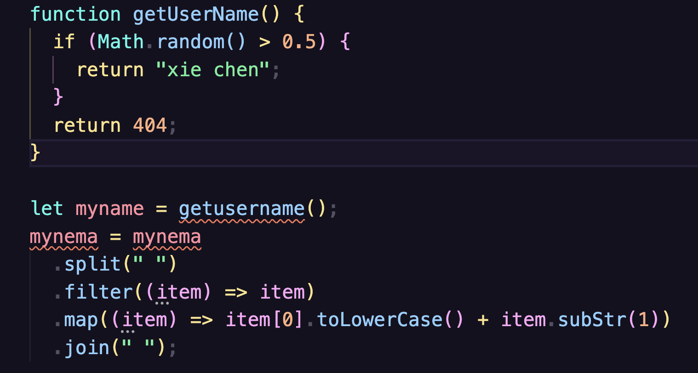
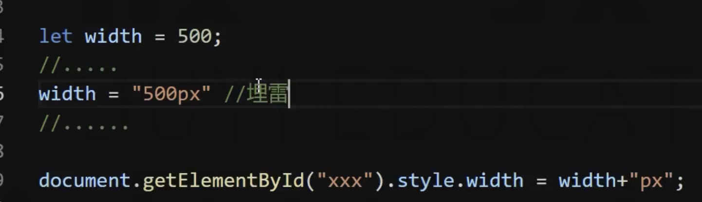
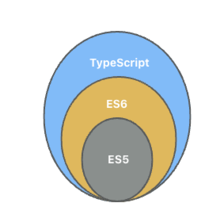

# Typescript 的概述

为什么需要 TS？

1、为了更好的开发体验

2、为了解决 JS 中一些难以处理的问题

## JavaScript 语言的问题

解决哪些难以处理的问题？例如下面这段代码：

```javascript
function getUserName() {
  if (Math.random() > 0.5) {
    return "xie chen";
  }
  return 404;
}

let myname = getusername();
mynema = mynema
  .split(" ")
  .filter((item) => item)
  .map((item) => item[0].toLowerCase() + item.subStr(1))
  .join(" ");
```

你们觉得存在什么问题呢？

以上代码的错误：

- 调用`getUserName()`函数时大小写拼写错误；

- 使用了不存在的变量`mynema`，应该是`myname`；

- 如果`getUserName`返回的不是字符串，而是一个 404 数字那么后续的方法也就都无法执行了；

<br />

这个时候如果我们使用 TS 就能很好的进行提示错误：



> 使用的编辑器的是 Visual Studio Code，且没有配置任何的内容。

<br />

或者一个更加常见的错误，我们经常会把一个接口返回内容赋值给一个变量，如果接口返回的是空数据，我们通常也会调用某个属性：

```javascript
const obj = undefined;
console.log(obj.name); // ❌产生报错
```

<br />

JS 的原罪：

- JS 语言本身的特性决定了该语言无法适应大型的复杂的项目，当初设计的目的就是为了实现一些简单的效果。

- JS 语言是弱类型语言，也就是一个变量赋值后可以随时更改其数据类型。



> 初始赋值是 500 的 number 类型，后面又赋值为 500px 的 string 类型。

- JS 语言是解释型语言，看一段代码执行一段，这就导致了代码必须是在运行后才知道错误，而不是在编写的时候就发现了错误。

综上，前端开发中大部分时候都是在排查错误，这个时候 TS 就出来了。

## TypeScript 语言的特点

官网：[JavaScript With Syntax For Types.](https://www.typescriptlang.org/zh/)

<br />

TS 语言是微软公司在 2012 年发布开源的。

TS 是 JS 的一个超集，是一个可选的静态类型系统。

- 超集：TS 是包括 JS 所有语法功能的，语言本身 JS 语言，只是新增了一些内容，新增的是一个类型的系统；



- 类型系统：对代码中所有的标志符（变量、函数、参数、返回值）都进行类型检查，例如数据类型是`number`那么后续就无法赋值为`string`类型；

- <XTextLight>可选的：类型系统可用可不用，不做强制的要求，如果使用了相应的语法那么就会进行类型，否则不会；</XTextLight>

- 静态的：TS 会进行类型检查，在编译阶段就会进行类型的检查，不必等到运行的时候才提示错误；

<br />

无论是浏览器环境还是 Node 环境都是无法直接使用 TS 的，我们安装安装对应的编译器把 TS 文件代码转换为 JS 文件代码后在执行（和 Babel 把 ES6+ 转换为 ES5 是一个道理），这个编译器就是 tsc。