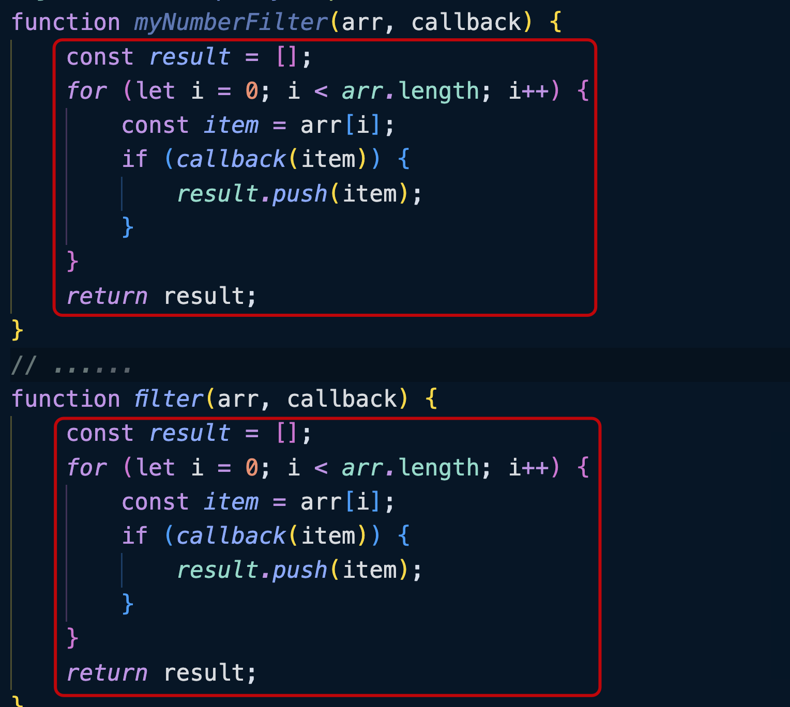
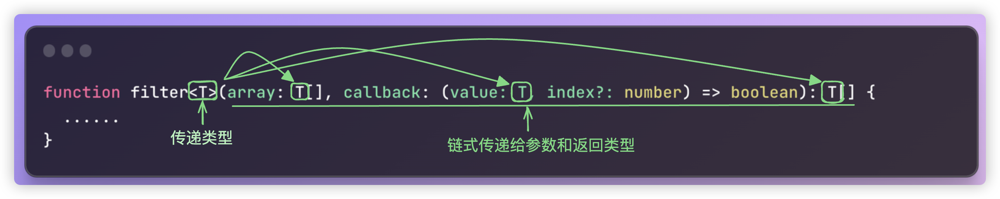

泛型在 TS 中是一个非常重要的概念。

例如有这么一个需求：使用 TS 封装一个函数，可以传递任意类型的参数，传入什么类型就返回类型类型。

仔细思考一下这个函数，参数应该有约束，返回的类型也应该和参数是同一个类型，那应该怎么办呢？如果直接标注为`any`类型，这样就丢失了 TS 的优势，返回的类型也不知道是什么类型了？

```typescript
function identity(value: any){
  return value;
}

const s = identity("hello");
```

如果使用函数的重载似乎可以解决这个问题：

```typescript
function identity(value: number): number;
function identity(value: string): string;
function identity(value: boolean): boolean;
function identity(value: number | string | boolean): number | string | boolean {
    return value;
}

const s = identity("aaa");
```

但是如果后面要支持的参数类型非常的多，这样写起来又不够优雅。

```typescript
function identity(value: number): number;
function identity(value: string): string;
function identity(value: boolean): boolean;
function identity(value: number[]): number[];
function identity(value: string[]): string[];
function identity(value: object): object;
function identity(
    value: number | string | boolean | number[] | string[] | object
): number | string | boolean | number[] | string[] | object {
    return value;
}

const s1 = identity([1, 2, 3, 4]);
const s2 = identity(["a", "b", "c", "d"]);
const s3 = identity({ id: 1, name: "aaa" });
```

<br />

如果能利用 TS 的自动推导功能就好了，也就是我当前不确定这里是什么类型，当实际用到的时候我再确定类型，那么这个类型就是「泛型」。

```typescript
function identity<T>(value: T): T{ 
  return value;
}
```

可以将`T`理解为一个类型的占位，表示任意的类型，但确是在调用`identity()`函数的时候才会确定这个`T`的类型。

本质上`T`和之前写的`number`、`string`等类型都是一个意思，只是当我调用的时候再传入具体的类型：

```typescript
function identity<T>(value: T): T {
    return value;
}

type User = {
    id: number;
    name: string;
};

const s1 = identity<number>(1);
const s2 = identity<string>("a");
const s3 = identity<User>({ id: 1, name: "aaa" });
```

当我调用`identity()`函数的时候，TS 其实完全可以根据我传入的参数自动的推导出泛型的类型，所以调用的时候可以省略`<>`：

```typescript
const s1 = identity(1);
const s2 = identity("a");
const s3 = identity({ id: 1, name: "aaa" });
```

<br />

你可能会问这里的`T`是什么意思，换成别的名称可以吗？

实际上`T`就是一个类型的名称，我可以换成任意有效的变量名，例如`A`、`B`、`C`都可以。

按照惯例，经常使用单个的大写字母，从`T`开始，依次是`U`、`V`、`W`等。如果是单词也完全没有问题，例如`ATest`、`ACC`，因为泛型字母本身就是一个占位的符号，类型检查器会根据上下文填充具体的类型。

<br />

一个复杂的案例：

```typescript
function myNumberFilter(arr: number[], callback: (item: number, index?: number) => boolean): number[] {
    const result = [];
    for (let i = 0; i < arr.length; i++) {
        const item = arr[i];
        if (callback(item)) {
            result.push(item);
        }
    }
    return result;
}

const filterArr1 = myNumberFilter(
  [1, 2, 3, 4, 5], 
  (item) => item % 2 === 0
);
console.log(filterArr1);

function filter<T>(arr: T[], callback: (item: T, index?: number) => boolean): T[] {
    const result = [];
    for (let i = 0; i < arr.length; i++) {
        const item = arr[i];
        if (callback(item)) {
            result.push(item);
        }
    }
    return result;
}

const filterArr2 = filter(
  ["xxx.js", "aaa.java", "bbb.md"], 
  (item) =>item.endsWith(".js")
);
console.log(filterArr2);
```

如果查看上面代码编译后的结果，你可以发现`myNumberFilter()`和`filter()`内部的逻辑是一模一样的：



因此写两个方法是没有必要的，保留一个`filter()`的泛型函数即可。



泛型能够让函数的功能，在编译的时候更具有一般性，比接受具体类型的函数更加强大。

<br />

泛型除了函数声明的方式，使用表达式同样是可以的：

```typescript
const filter = <T>(array: T[], callback: (value: T, index?: number) => boolean): T[] => { 
	// ......
}
```

