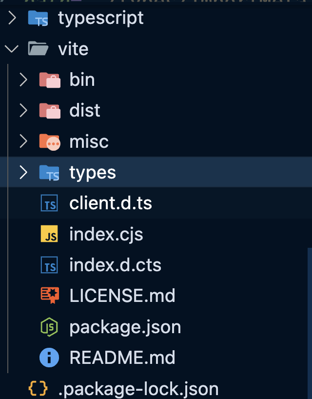
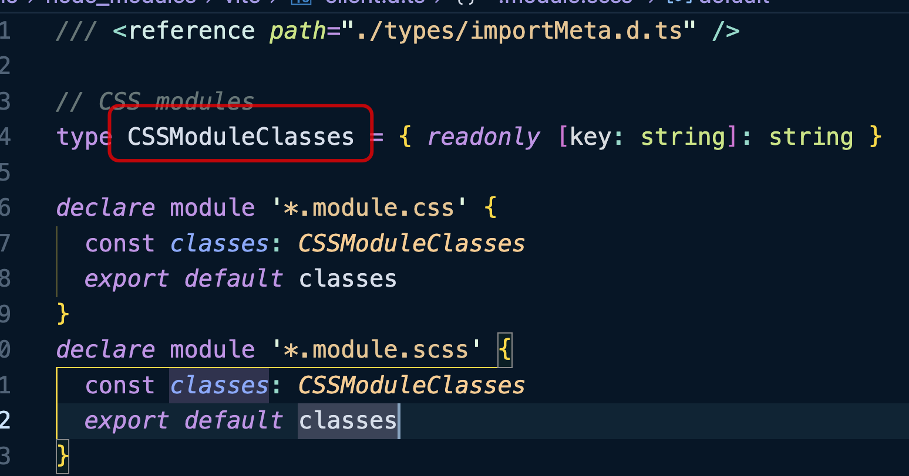
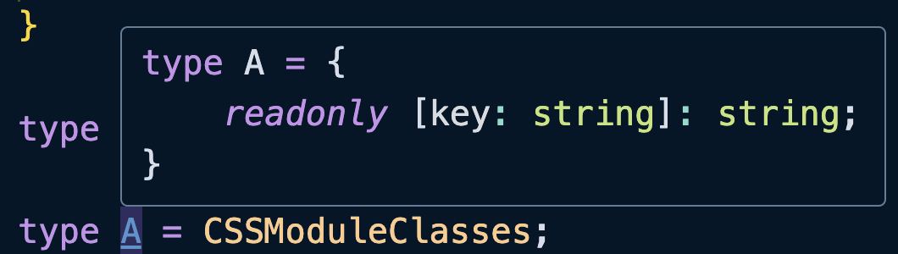

当我们编写一个全局声明文件的时候可能有需要依赖其他的声明文件，但是文件内又不想出现`import`去导入其他的声明文件，这个时候就可以使用「三斜线指令」。

<br />

三斜线指令本质上就是一个自闭合的 XML 标签，语法如下：

```typescript
/// <reference path="./xxx.d.ts" />
/// <reference types="node" />
/// <reference lib="es2017.string" />
```

可以看出三斜线指令也是一张注释语句，只不过在原来的双斜线基础上加了一条斜线，然后通过`<reference>`标签来引入另外一个声明文件。

该标签有三个参数：

+ `path`：用于声明对另一个文件的依赖；

+ `types`：用于声明对另外一个库的依赖；

+ `lib`：用于声明对内置库的依赖；


::: tip
我们为什么需要引入呢？全局声明文件不是全局都能用吗？

因为TS编译器会处理 tsconfig.json 的`file`、`include`、`exclude`对应目录下的所有 .d.ts 文件。也就是说，如果在自己的项目中，出现了`exclude`的 .d.ts 文件是引用不了的。

另外，还有可能是我们需要引用其他第三方库的 .d.ts 文件。

还有一种可能在第三方库中，尤其是 DefinitelyTyped 项目中，.d.ts 文件内容如果过于庞大，通常会将其拆分成多个文件，以便更清晰地组织和管理内容。这个时候就可以通过三斜线指令进行引用，从而实现模块化和更好的维护性。
:::

<br />

示例：

```typescript
// src/type.d.ts

/// <reference path="../types/student.d.ts" />

interface User {
    id: number;
    name: string;
    level?: Level;
}

type showStudent = (stu: Student) => void;
```

```typescript
// types/student.d.ts

interface Student {
    id: number;
    name: string;
}

type Level = "plain" | "silver" | "gold" | "platinum" | "diamond";
```

<br />

:::warning
三斜线指令只能用于文件的头部，如果用在其他的地方，会被当作普通的注释。另外，若一个文件中使用了三斜线命令，那么在三斜线指令之前只允许使用单行注释、多行注释和其他三斜线命令，否则三斜杠命令也会被当作普通的注释。
:::

<br />

我们还可以引入一下其他第三方包的 .d.ts 文件，例如 Vite：

```bash
$ npm install vite
```

找到 Vite 的包：



就以 client.d.ts 文件为例：



编写代码：

```typescript
/// <reference types="vite/client" />

type A = CSSModuleClasses;
type B = ImportMeta["env"];
```

结果是正常的：



<br />

`<reference types>`也是有索引规则的，首先会在 node_modules 的 @types 下查找，没有的话，然后才到同名项目下查找，和 NodeJS 的模块查找规则很类似，具体关于模块查找解析的内容这里就不展开了。

