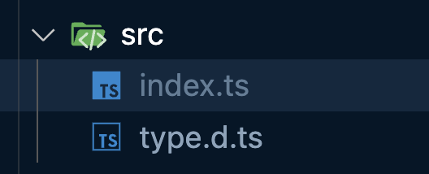
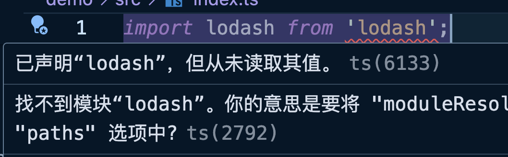
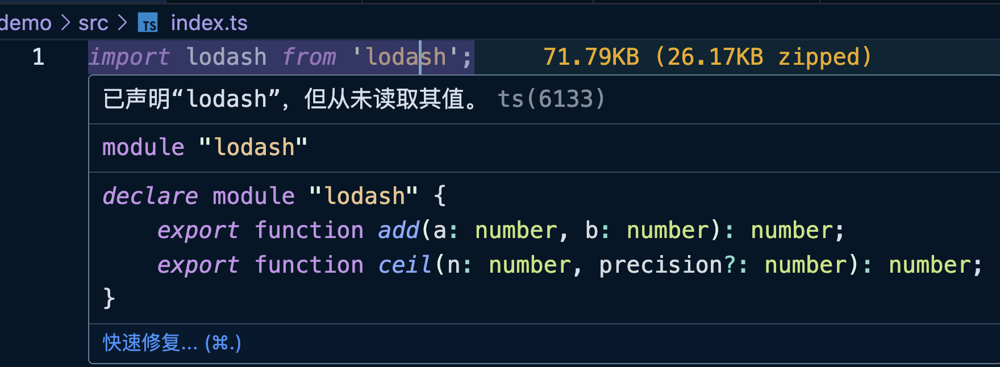
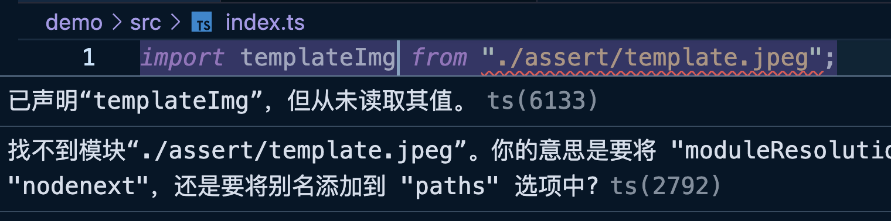
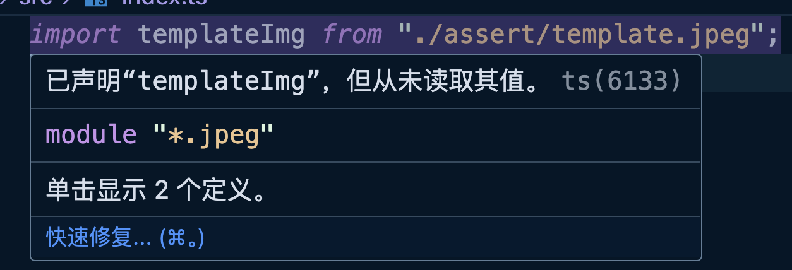

之前我们说过类型声明文件的作用，详见：

[类型声明文件](https://www.yuque.com/xiechen/wz37ci/tt8ntg1gkbo5fdyq)


从类型声明文件中可以看出，基本上使用的都是`declare`关键字进行声明的。`declare`是用于告诉 TS 编译器某个变量、常量、函数或类已经存在，即使它在当前文件中没有定义。这是一种类型声明的方式，容许你在不提供实现的情况下，定义一个变量的类型。

它是通知编译器某个类型是存在的，不用给出具体的实现。**<font style="background-color:#F9EFCD;">而且，最重要的是</font>**`**<font style="background-color:#F9EFCD;">declare</font>**`**<font style="background-color:#F9EFCD;">关键字修饰的只要不在模块文件中都是全局声明，也就是文件 .d.ts 文件中声明之后，后续就可以直接使用了，不用再进行导入等这些操作。</font>**

<br/>warning
⚠️ 注意

只要声明文件中出现顶层的`import`或`export`，那么这个声明文件就会被当做模块，模块中所有的声明都是局部变量或局部类型，必须`export`导出后，才能在其他文件中`import`导入使用。

<br/>


`declare`关键字可以描述以下类型：

+ 变量（`const`、`let`、`var`命令声明）
+ `type`或者`interface`命令声明的类型
+ `class`
+ `enum`
+ 函数（`function`）
+ 模块（`module`）
+ 命名空间（`namespace`）

<br/>warning
⚠️ 注意

如果`.d.ts`类型声明文件和可执行的`.ts`文件在同一目录下，文件名不能同名。

<br/>

目录结构：



示例 .d.ts 文件：

```typescript
// types.d.ts

declare var num: number;
declare let str1: string;
declare const str2 = "hello";

declare function power(a: number, b: number): number

type FnAdd = (a: number, b: number) => number

interface User  { 
    id: number
    name: string
}

declare module "foo" { 
    export var bar: number;
    export function baz(a: number): string;
}
```

示例调用：

```typescript
import { bar, baz } from "foo";

console.log(num);
console.log(str1);
console.log(str2);
const p = power(1, 2);

console.log(bar);
baz(10);
```

**<font style="background-color:#F9EFCD;">上面的代码在 TS 中并不会报错，因为在类型声明文件中已经声明了。但是编译后并不能执行，因为运行时少了具体的实现，其实应该还有一个具体实现 JS 文件。</font>**

**<font style="background-color:#F9EFCD;"></font>**

##  declare module
`declare module`应该算类型声明中的语法，其作用就是在一般的工作场景中对模块声明进行增强。

例如我们导入了一个 lodash 的包，但是这个包没有类型声明文件，这个时候 TS 就会提示错误：



我们可以自己编写一个 .d.ts 文件来屏蔽这个错误：

```diff
src
  index.ts
+ lodash.d.ts
```

```typescript
//lodash.d.ts
declare module "lodash" {
    export function add(a: number, b: number): number;
    export function ceil(n: number, precision?: number): number;
}
```



这个时候 TS 就会找到同级目录中的 lodash.d.ts 文件，并作为类型声明。


再例如我们使用某些打包工具的时候可能需要导入一张照片：



同样的，我们可以在声明文件中对这个模块进行声明：

```typescript
// type.d.ts
declare module "*.jpeg" {
    const src: string;
    export default src;
}
```



这样导入图片后就不会报错了。甚至如果要导入的是 CSS 文件，也可以使用这种模块化的方式去解决。

不过需要注意的是，这种方式用到了通配符`*`，所以仅仅相当于告诉了 TS，遇到了这种后缀的模块化引入就别报错了，但是并不会去验证路径到底是否正确。


##  declare namespace
`namespace`是 TS 早期为了解决模块化而创造的关键字，中文为命名空间。`namespace`可以用来作为命名的区分，例如：

```typescript
export namespace User {
  
    export interface Address {
        province: string;
        city: string;
    }
  
    export interface UserInfo {
        _id: string;
        address: Address;
        age: number;
        loginId: string;
        loginPwd: string;
        loves: string[];
        name: string;
    }
}
```

```typescript
import type { User } from "./type";

const user: User.Address = {
    province: "江苏省",
    city: "南京市"
};
```


##  declare global
如果我们希望定义全局类型，那么久必须定义在非模块文件中（也就是没有`import`和`export`的文件中）。

但是如果我们当前的文件已经是一个模块化的文件了，且依然希望导出一个全局类型，那么就可以使用`declare global`：

```typescript
// global.d.ts

export {}

declare global{
  interface User { 
    id: number
    name: string
  }
}
```

```typescript
// 不需要导入就可以使用
let u: User = {
    id: 1,
    name: "typescript"
};
```


如果我们要给全局类型`String`原型上添加一个类型，也可以在`declare global`进行定义，这样就可以实现拓展的效果：

```typescript
// global.d.ts

export {};

declare global {
    interface String {
        prependHello(): string;
    }
}
```

```typescript
if (!String.prototype.prependHello) {
    String.prototype.prependHello = function () {
        return "Hello, " + this;
    };
}

console.log("typescript".prependHello());
```


总之，我们需要注意：如果类型声明文件中出现了`import`或者`export`等关键字，那么 TS 就会认为这个文件是一个模块声明，那么文件中所有使用`declare`声明的类型就自动变为了局部声明。使用`declare global`声明的类型就变成了全局的声明。


##  声明合并
我们知道接口是可以声明合并的，但其实声明合并是 TS 中一个比较重要的特性，因此并不是接口独有的。

详见：

[https://www.typescriptlang.org/docs/handbook/declaration-merging.html](https://www.typescriptlang.org/docs/handbook/declaration-merging.html)

