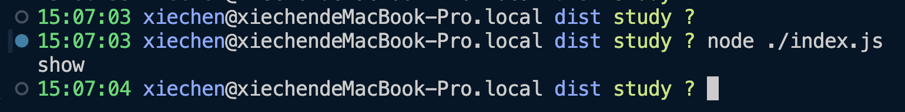

例如有这么一段代码：

```typescript
import { show } from "./myModule";
show();
```

```typescript
export function show() {
    console.log("show")
}
```

当我们没有配置 tsconfig.json 的时候，直接使用 CLI 将 index.ts 文件进行编译可以得到下面的结果：

```bash
$ npx tsc
```

```javascript
"use strict";
Object.defineProperty(exports, "__esModule", { value: true });
var myModule_1 = require("./myModule");
(0, myModule_1.show)();
```

```javascript
"use strict";
Object.defineProperty(exports, "__esModule", { value: true });
exports.show = show;
function show() { }
```

从上面的结果中我们可以看出，编译后的代码模块化为 CommonJS 的规范，这是因为 TS 配置默认`"target": "ES5"`，如果是`ES5`的话则`module`默认为`"CommonJS"`，[详见](https://www.typescriptlang.org/tsconfig/#module)。

<br/>tips
❕ 信息

`target`是配置 TS 编译为 JS 后的版本。

<br/>


为了更加方便我们进行配置，可以创建一个 TS 的配置文件：

```bash
# 生成 tsconfig.json 配置文件
$ npx tsc --init
```


##  module 属性
<br/>tips
❕ 信息

`module`是配置 TS 编译为 JS 后的模块化规范。

<br/>

在 typescript@5 的版本中，`module`取值如下：

+ none
+ commonjs
+ amd
+ umd
+ system
+ es6/es2015
+ es2020
+ es2022
+ esnext
+ node16
+ nodenext


`target`和`module`直接存在一些关联：

+ 当`target`属性为 es6/es2015 的时候，`module`默认为 commonjs；
+ 当`target`属性其他值的时候，`module`默认为 ES6/ES2015；


### ESM 模块化的问题
例如当我们的 tsconfig.json 文件如下：

```json
{
    "compilerOptions": {
        "target": "ESNext",                                  
        "module": "CommonJS",                                
        "outDir": "./dist",  // 编译后.js文件的位置                                 
        "esModuleInterop": true,                             
        "forceConsistentCasingInFileNames": true,            
        "strict": true,                                      
        "skipLibCheck": true                                 
    }
}
```

```javascript
"use strict";
Object.defineProperty(exports, "__esModule", { value: true });
const myModule_1 = require("./myModule");
(0, myModule_1.show)();
```

编译后的 JS 文件是可以直接运行的：




如果当我把`module`删除后，再执行编译后的文件就会报错：

```diff
{
    "compilerOptions": {
        "target": "ESNext",                                  
-        "module": "CommonJS",                                
        "outDir": "./dist",  // 编译后.js文件的位置                                 
        "esModuleInterop": true,                             
        "forceConsistentCasingInFileNames": true,            
        "strict": true,                                      
        "skipLibCheck": true                                 
    }
}
```

```javascript
import { show } from "./myModule";
show();
```


根据上面的代码可以看出，删除`module`属性后，编译后的 JS 文件模块化变成了 ESM，当在控制台执行这个 JS 文件的时候就会提示模块错误的问题。


虽然在 NodeJS 中（>=12.2 版本）中可以使用原生的 ESM，但是必须遵守下面的规则：

+ 文件以`.mjs`结尾；
+ package.json 文件中声明`"type": "module"`；

我们可以根据上面的两个规则自行调整，我这里就直接更改 package.json 文件了。

```diff
{
    "name": "code",
    "version": "1.0.0",
    "main": "index.js",
+    "type": "module",
    ...
}

```

更改后在运行代码:

```bash
$ node ./dist/index.js
```

运行结果：


可以发现还是报错，错误的原型是找不到`myModule`这个文件，而是找到了`myModule.js`这个问题。

产生这个错误的主要原因是因为 CommonJS 模块查找策略不同导致的。


### CMJ 模块查找策略
对于`require()`语句引入一个模块来说：

+ 文件模块：如果路径是一个相对路径（如 ./module）或绝对路径（如 /path/to/module），NodeJS 会先尝试按照给出的路径查找文件。如果有相应的文件名直接匹配，则加载该文件。否则，会尝试添加 .js、.json、.node 等后缀名；
+ 目录模块：如果路径是一个目录，NodeJS 会查找该目录下的 package.json 文件，并根据其`main`字段指定的文件名进行加载。如果没有 package.json 或`main`字段，NodeJS 会尝试加载目录下的 index.js 或 index.node 文件；
+ 内置模块：如果模块名对应一个 NodeJS 的内置模块（如`fs`，`http`），那么就直接返回该模块，不进行文件查找；
+ node_modules 查找：如果上述步骤都未能解析模块，NodeJS 会在当前文件夹的父目录中查找 node_modules 文件夹，并尝试在其中查找模块。这一过程会一直向上递归至文件系统的根目录；


对于`ESM`模块的`import`语句引入一个模块来说：

+ 文件扩展名：导入模块时必须指定文件的完整路径和扩展名（如 .js、.mjs）。ESM 不能直接支持将一个目录作为导入路径的方式。如果你希望通过 ESM 导入一个目录下的模块，你需要指定目录中具体文件的路径，包括扩展名（如`import { something } from './someDir/index.js'`）；
+ URL 支持: 支持直接通过 URL 导入模块；
+ node_modules 查找: 在 NodeJS 环境中，ESM 支持从 node_modules 目录查找模块，查找逻辑与CommonJS 相似，但更严格地遵守文件扩展名和路径的准确性。但是注意在浏览器环境中，并不支持，必须要给上全路径；
    - node_modules 第三方库模块的路径导入方式，也被称为 bare import；

所以，这就是为什么上面的代码运行提示无法找到`myModule`文件的原因。


##  moduleResolution 属性
<br/>tips
❕ 信息

`moduleResolution`是配置 TS 查找模块规则的。

<br/>

在 typescript@5 的版本中，`moduleResolution`取值如下：

+ classic
+ node10/node
+ node16
+ nodenext
+ bundler

> classic 只是 tsc 自身默认的模块寻找方式，但这个方式已经不常用了。
>


### node/node10
TS 的编译器会模仿早期的 NodeJS 模块查找方式去加载模块。

+ 简单来说，如果是相对路径，如果发现有文件，就会补全 .js 后缀路径，如果没有就再查找有没有这个路径的文件夹，查找这个文件夹下的 index.js 文件；
+ 如果是 bare import 路径，那么就去查找 node_modules 目录，并且依次向上层追溯 node_modules 目录直到最顶层为止；


不过因为是 TS 的配置，又会有一些区别，例如 src/index.ts 文件引入 src/myModule.ts 文件（这里还会收到 TS 配置文件中`include`以及其他配置的影响，这里先不考虑），依次寻找：

依次寻找:

+ ./src/myModule.ts
+ ./src/myModule.tsx
+ ./src/myModule.d.ts
+ ./src/myModule/package.json(访问`"types"`字段)
+ ./src/myModule/index.ts
+ ./src/myModule/index.tsx
+ ./src/myModule/index.d.ts


这仅仅是相对路径的情况，如果是 bare import 路径，则更加复杂：

```typescript
import axios from "axios";
```

（最好指定`"moduleResolution": "node/node10"`）

此时，加载 axios 的过程变成了：

+ ./src/node_modules/axios.ts
+ ./src/node_modules/axios.tsx
+ ./src/node_modules/axios.d.ts
+ ./src/node_modules/axios/package.json(访问`"types"`字段)
+ ./src/node_modules/@types/axios.d.ts
+ ./src/node_modules/axios/index.ts
+ ./src/node_modules/axios/index.tsx
+ ./src/node_modules/axios/index.d.ts
+ 如果当前目录没找到，继续向上再来一次
+ /node_modules/axios.ts
+ /node_modules/axios.tsx
+ /node_modules/axios.d.ts
+ /node_modules/axios/package.json(访问`"types"`字段)
+ /node_modules/@types/axios.d.ts
+ /node_modules/axios/index.ts
+ /node_modules/axios/index.tsx
+ /node_modules/axios/index.d.ts
+ 如果当前目录没找到，继续向上再来一次......
+ ......


TS 希望在代码引用的路径既能找到对应的类型定义文件（`.d.ts`文件）（提供类型信息），又能在运行的时候找到实际的 JS 实现文件。对于任何运行时才会查找的 JS 文件模块路径，TS 都会优先查找同名的 .ts 或者 .d.ts 文件。

```typescript
import { show } from "./myModule.js";
// 运行时查找: "./myModule.js"
// TS 查找1: "./myModule.ts"
// TS 查找2: "./myModule.d.ts"
// TS 查找3: "./myModule.js"
```


详见：

[Documentation - Modules - Reference](https://www.typescriptlang.org/docs/handbook/modules/reference.html#the-moduleresolution-compiler-option)


我们必须清楚两个事情：

1、相对路径在 .ts 中不报错，不一定在 .js 文件代码也不报错；

例如下面的代码不会报错：

```typescript
import { show } from "./myModule";
show();

/*
  "target": "ESNext"
  "module": "ESNext"
  "moduleResolution": "node10"
*/
```

编译后无法执行：


**<font style="background-color:#F9EFCD;">因为 TS 编译后不会更改我们的模块路径，TS 中写的什么编译后就是什么！</font>**

2、我们通过 .ts 关联的都是 .ts 或者 .d.ts 文件，不会直接跳转到具体的 JS 实现文件；


### node16 和 nodeNext
由于新版的 NodeJS 同时支持 ESM 和 CMJ，所以就出现了这两个属性值（目前，`nodeNext` 和`node16`是一致的，将来如果 NodeJS 更新了模块查找策略，那么`nodeNext`也会慢慢同步最新的策略）。

当设置`"moduleResolution": "nodeNext"`后，`"module"`也必须是`"module": "nodeNext"`，否者就会出现错误。

由于`"moduleResolution": "nodeNext"`支持 ESM 和 CMJ 两种模块化规范，如果我们不写后缀名编译后运行就会出现错误（尽管设置了 package.json 文件中的`"type"`属性）。


但是如果我们在 TS 文件中加上后缀名，也不能加上 .ts 后缀名：


如果是 .js 的后缀名则可以：


这主要是因为 TS 编译后模块说明符会原封不动的被转译。


### exports 属性
`"moduleResolution": "nodeNext" / "node16"`和`"moduleResolution": "node"`基本一致，只不过`"moduleResolution": "nodeNext" / "node16"`支持`exports`属性的解析。


TS 查询模块的时候也会根据 package.json 文件中的`exports`属性进行解析，例如 axios 库的 package.json 文件：

```json
{
    "main": "index.js",
    "exports": {
        ".": {
            "types": {
                "require": "./index.d.cts",
                "default": "./index.d.ts"
            },
            "browser": {
                "require": "./dist/browser/axios.cjs",
                "default": "./index.js"
            },
            "default": {
                "require": "./dist/node/axios.cjs",
                "default": "./index.js"
            }
        },
        ......
    },
    "type": "module",
    "types": "index.d.ts",
    "jsdelivr": "dist/axios.min.js",
    "unpkg": "dist/axios.min.js",
    ......  
}

```

随着 ESM 等打包工具的发展，一个库可能需要支持多种引入方式，使用`"exports"`属性可以配置不同的引入模式指向不同的文件路径。

详见：

[Modules: Packages | Node.js v23.5.0 Documentation](https://nodejs.org/api/packages.html#package-entry-points)


如果希望指定类型文件，那就配置`"types"`字段。当 TS 解析一个包的时候，`"exports"`是高于`"types"`字段的，解析模块的过程大致如下：

+ ./src/node_modules/axios.ts
+ ./src/node_modules/axios.tsx
+ ./src/node_modules/axios.d.ts
+ ./src/node_modules/axios/package.json(优先访问`"exports"`字段，后访问`"types"/"main"/"module"`字段)
+ ./src/node_modules/@types/axios.d.ts
+ ./src/node_modules/axios/index.ts
+ ./src/node_modules/axios/index.tsx
+ ./src/node_modules/axios/index.d.ts
+ 如果当前目录没找到，继续向上再来一次
+ /node_modules/axios.ts
+ /node_modules/axios.tsx
+ /node_modules/axios.d.ts
+ /node_modules/axios/package.json(优先访问`"exports"`字段，后访问`"types"/"main"/"module"`字段)
+ /node_modules/@types/axios.d.ts
+ /node_modules/axios/index.ts
+ /node_modules/axios/index.tsx
+ /node_modules/axios/index.d.ts
+ 如果当前目录没找到，继续向上再来一次......
+ ......


## 模块化解析最佳实践
使用`"moduleResolution": "bundler"`。

比如 Vite，声称是完全基于 ESM 的打包工具，但是为了用户方便，声明相对路径模块的时候却不要求写扩展名。这其实是和 ESM 的标准冲突的，但是这种做法是没有毛病的。本身用户之前已经习惯了在引入模块的时候不写后缀名，毕竟甚至好多程序员都已经把文件夹下写一个 index.js 当成标准了。

但是问题就出在现有的几个模块解析策略，都不能完美适配 Vite + typescript + ESM 的开发场景：

+ 如果`"moduleResolution": "node"`，对于 ESM 支持不好；
+ 如果`"moduleResolution": "node16" / "nodenext"`，强制要求使用相对路径模块时必须写扩展名；
+ `"moduleResolution": "node16" / "nodenext"`实际上算是 typescript 中完美的解决方案，但是在打包器环境中实在是非常尴尬。

所以才有了`"moduleResolution": "bundler"`，目的就是告诉你，模块解析就交给打包器了，typescript 不再负责，而且不负责模块解析的话，由 typescript 去编译生成js文件就并不安全了。

而且选择`"moduleResolution": "bundler"`的话，`module`就只能是 ESM 相关的配置。


那么如何搭配`"module"`和`"moduleResolution"`呢？

+ 如果打算编写 CommonJS 的 NodeJS 程序，不支持解析`exports`字段：

```latex
"module": "CommonJS"
"moduleResolution": "Node"
```

+ 如果打算支持 NodeJS 比较新的内容，无论是 CommonJS 还是 ESM：

```latex
"module": "NodeNext"
"moduleResolution": "NodeNext"
```

当然，ESM需要设置 package.json 的`"type": "module"`，要么通过后缀区分 .cjs、.mjs。

+ 如果是 Vite 的环境中:

```latex
"module": "ESNext"
"moduleResolution": "Bundler"
```

+ 如果是 Webpack 相关的打包环境中：

```latex
"module": "ESNext"
"moduleResolution": "node"
```

