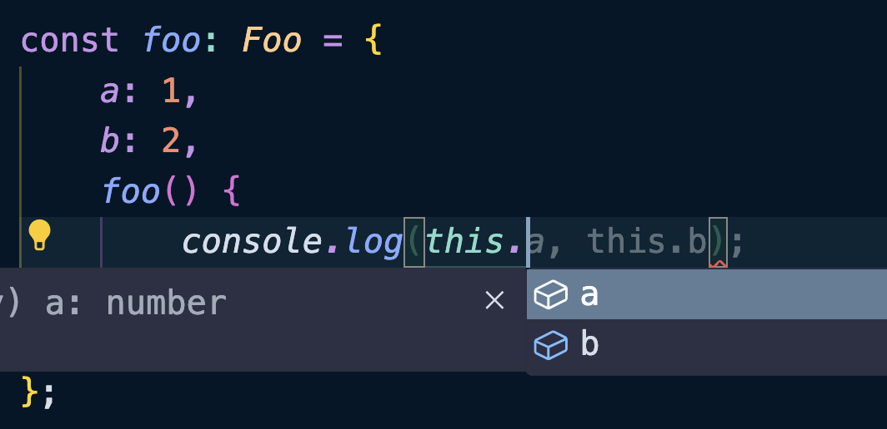
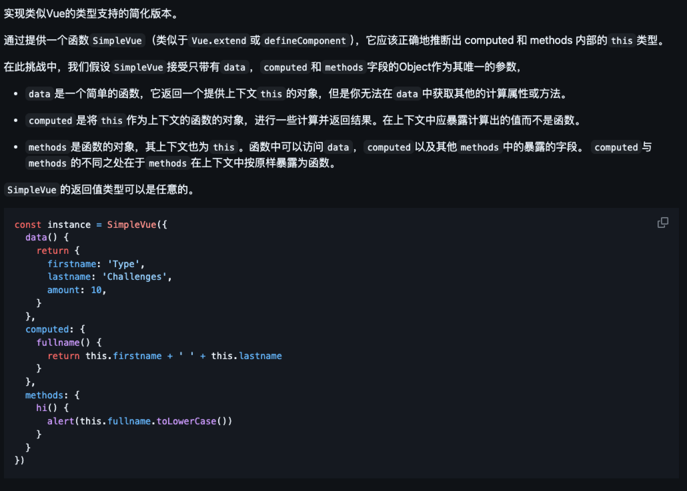
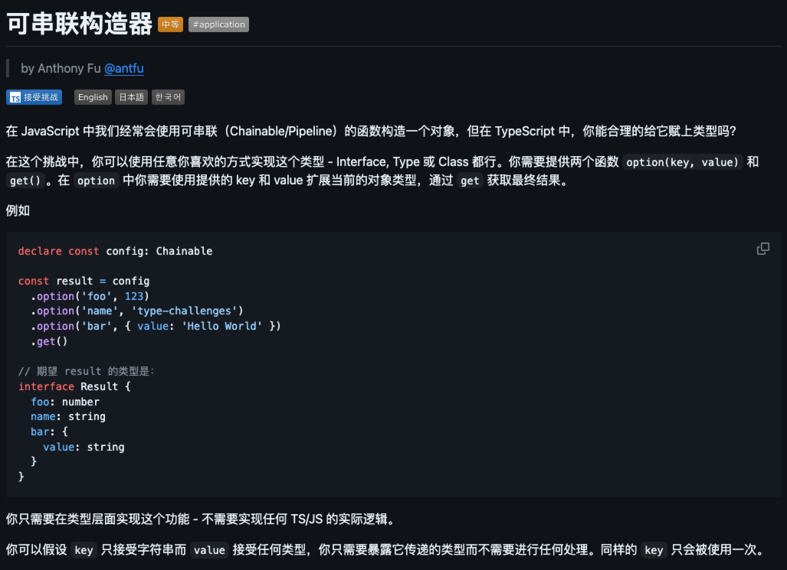

## `ThisType<Type>`

`ThisType<Type>`可以让`Type`充当上下文类型的标记`this`。简单说，就说限制`this`的类型，限制`this`可以访问哪些属性。

示例：

```typescript
type Foo = {
    a: number;
    b: number;
    foo(): number;
} & ThisType<{
    a: number;
    b: number;
}>;

const foo: Foo = {
    a: 1,
    b: 2,
    foo() {
        return this.a + this.b;
    }
};
```



根据上面的代码我们可以看出，我们在`foo.foo()`函数中访问`this`的时候只会提示`a`和`b`属性，而`Foo`类型还有一个`foo`属性，这就是`ThisType<T>`的作用，限制我们可以访问`this`上的哪些属性。

<br />

再比如下面这个示例：

```typescript
type Bar = {
    a: number;
    b: number;
};

type Foo = {
    foo: () => number;
} & ThisType<Bar>;

const foo: Foo = {
    foo() {
        return this.a + this.b; // ✅
    }
};
```

从上面的代码可以看到`foo()`函数可以访问到`a`和`b`属性，但是`foo`上是没有定义这两个属性的。

这种情况下，只是类型提示上不会产生错误，但是运行的时候会报错。

##  SimpleVue

SimpleVue 意为简易版本的 Vue，来源于 Github 上 type-challenges 仓库的一道题目，[详见](https://github.com/type-challenges/type-challenges/blob/main/questions/00006-hard-simple-vue/README.zh-CN.md)。

其实就是要求实现 Vue 中`data`、`computed`和`methods`的类型标注。



完成这个题目只需要四个关键点即可：

+ 函数中的`this`类型；
+ `ThisType<T>`工具的使用；
+ 映射类型重映射；
+ `infer`推断；

```typescript
function SimpleVue<D, C, M>(options: {
    data: (this: void) => D;
    computed: C & ThisType<D>;
    methods: M & ThisType<D & getComputed<C> & M>;
}): any;

type getComputed<T> = {
    readonly [key in keyof T]: T[key] extends (...args: any[]) => infer R ? R : never;
};
```

##  chainable-options

chainable-options 也是 Github 上 type-challenges 仓库的一道题目，[详见](https://github.com/type-challenges/type-challenges/blob/main/questions/00012-medium-chainable-options/README.zh-CN.md)。



这道题目简单来说，每次`option`链式调用的函数会将属性添加到对象中，而且属性名不能重复，如果重复了就取后面那一次的属性和值的类型。

一开始我们这样思考，`option`每次返回的类型肯定是之前的`T`类型与`option`调用之后的对象字面量类型交叉：

```typescript
type Chainable<T = {}> = {
    option<K extends string, V>(key: K, value: V): Chainable<T & { [P in K]: V }>;
    get(): T;
};
```

`Chainable`有一个默认的空类型`T`，然后调用`option`方法后返回的是一个`Chainable`类型，这样就可以链式调用了。

`T & { [P in K]: V }`表示在现有类型`T`的基础上，新增了键值对`{ [P in K]: V }`。

接着，如果出现同名的 Key 就将其排除，这一步我们使用`Exclude`类型工具实现：

```typescript
type Chainable<T={}> = {
    option<K extends string, V>(key: Exclude<K, keyof T>, value: V): Chainable<T & {[P in K]: V}>;
    get(): T;
}
```

最后，每次返回的`T`，应该忽略当前的`K`，如果没有同名的就没有任何的影响，如果出现同名才会触发：

```typescript
type Chainable<T = {}> = {
  option<K extends string, V>
  (
    key: Exclude<K, keyof T>, 
    value: V
  ): Chainable<Omit<T, K> & { [P in K]: V }>;
  get(): T;
}
```

下面解释一下这个代码：

1. `T`的含义：
    - `T`是累积的配置对象类型，初始值默认为空对象`{}`。
2. `option<K, V>`的作用：
+ 添加一个新的键值对到累积的类型`T`。
+ `K`的限制：
    - 必须是字符串字面量类型 (`K extends string`)。
    - 必须是`T`中尚未存在的键 (`Exclude<K, keyof T>`)。
+ 返回值是一个新的`Chainable`，新累积的类型是`Omit<T, K> & { [P in K]: V }`：
    - `Omit<T, K>`确保如果 `K`已经存在，会覆盖之前的值。
    - `{ [P in K]: V }`添加新的键值对。
3. `get()`的作用：
    - 返回当前累积的类型`T`。

<br />

实现这个类型：

```typescript
const config = {} as Chainable;

const result = config
  .option("name", "Alice")
  .option("age", 30)
  .option("isAdmin", true)
  .get();

// 🤔 ResultType: { name: string; age: number; isAdmin: boolean }
type ResultType = typeof result;

// 🤔 const result: { name: "Alice", age: 30, isAdmin: true }
console.log(result); 
```

