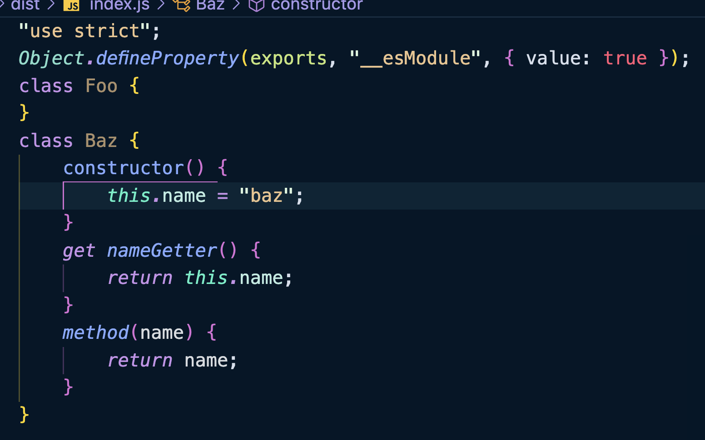
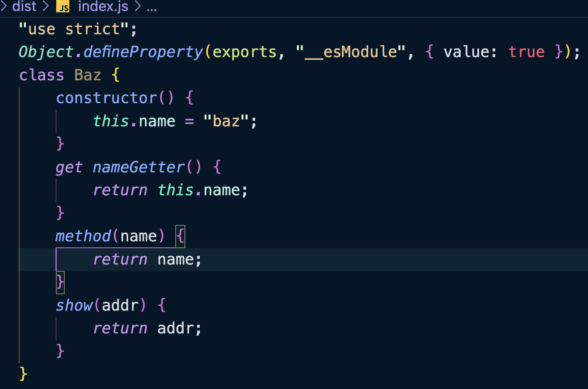
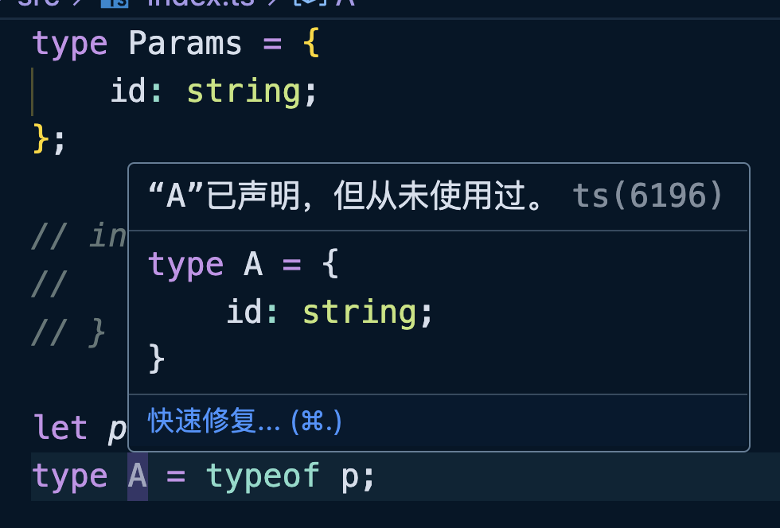
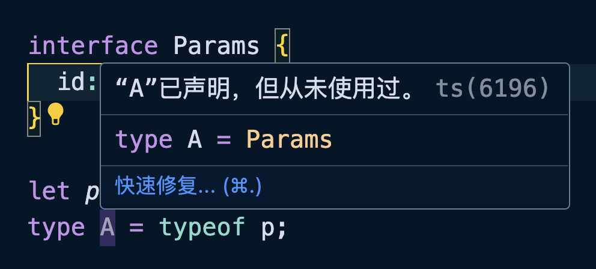

##  类继承接口

面向对象中另外一个重要的概念就是接口，按照面向对象的说法来说，接口是比抽象类还要抽象的概念，在接口中就只有抽象的方法和属性，相当于就只能声明接口，不能有具体的实现。

接口的面向对象特征：

+ 接口中只能有抽象的属性和方法，只能声明结构，不能有具体的实现；
+ 接口不能使用访问修饰符，接口中的属性默认是`public`；
+ 类和接口的实现使用`implements`关键字；
+ 接口可以多实现，类的继承具有多单根性，但是接口没有；
+ 接口和接口之间可以使用`extends`关键字进行继承；

<br />

示例：

```typescript
interface Foo {
    name: string;
    // public age: number; // ❌ “public”修饰符不可出现在类型成员上
    get nameGetter(): string;
    method(name: string): string;
}

interface Bar {
    show(addr: string): string;
}

// 类实现接口，不能使用 extends 关键字
class Baz implements Foo, Bar {
    name = "baz";

    get nameGetter(): string {
        return this.name;
    }

    method(name: string): string {
        return name;
    }

    show(addr: string): string {
        return addr;
    }
}
```

其实编译之后的抽象类，至少还有一个空的类，而编译之后的接口什么都没有，被直接删除了。





##  声明合并
`interface`接口还有一个非常重要的特性就是声明合并，就是 TS 会自动把多个同名的`interface`接口声明组合在一起（枚举和命名空间也有这个特性）：

```typescript
interface User {
    readonly id: number;
    name: string;
    show: (addr: string) => void;
}

interface User {
    age: number;
}

const u: User = { // ❌ 类型 "{ id: number; name: string; show(addr: string): void; }" 中缺少属性 "age"，但类型 "User" 中需要该属性。
    id: 1,
    name: "ruby",
    show(addr: string): void {
        console.log(addr);
    },
    // age: 13
};
```

虽然可以进行合并但是不能有冲突，如果出现同键名但是值类型不同的情况会报错：

```typescript
interface User {
    readonly id: number;
    name: string;
    show: (addr: string) => void;
    age: string;
}

interface User {
    age: number; // ❌ 后续属性声明必须属于同一类型。属性“age”的类型必须为“string”，但此处却为类型“number”
}
```

##  接口和类型别名混用

接口和接口之间也可以进行继承：

```typescript
interface User {
    id: number;
    name: string;
}

interface Person extends User {
    age: number;
}

class Admin implements Person {
    id: number = 1;
    name: string = "admin";
    age: number = 18;
}
```

<br />

接口和类型别名之间也能有继承关系，同样是使用`extends`：

```typescript
type Action = {
    type: string;
    get(): string;
    set(v: string): void;
};

interface Person extends Action {
    sex: "男" | "女";
}

const p: Person = {
    type: "person",
    get(): string {
        return "hello";
    },
    set(v: string): void {
        console.log(v);
    },
    sex: "男"
};
```

反过来也行，但是使用的是交叉运算符：

```typescript
interface Action {
    type: string;
    get(): string;
    set(v: string): void;
}

type Person = Action & { sex: "男" | "女" };

const p: Person = {
    type: "person",
    get(): string {
        return "hello";
    },
    set(v: string): void {
        console.log(v);
    },
    sex: "男"
};
```

##  类使用接口的理解

接口在类（或面向对象）中的作用就是上层抽象的作用，调用接口的人不需要关心接口是如何实现的，只关心得到的是什么即可。

示例：

```typescript
// 定义一个接口，需要一个泛型
interface Repository<T> {
    findById(id: number): T | undefined;
    save(user: T): void;
    delete(user: T): boolean;
}
```

```typescript
class User {
    constructor(public id: number, public name: string) {}
}

// 使用接口，并将 User 当作泛型参数传递
class UserRepository implements Repository<User> {
    private users = new Map<number, User>();

    findById(id: number): User | undefined {
        return this.users.get(id);
    }

    save(user: User): void {
        this.users.set(user.id, user);
    }

    delete(user: User): boolean {
        return this.users.delete(user.id);
    }
}

// 实例化
const userRepository = new UserRepository();
userRepository.save(new User(1, "张三"));
userRepository.save(new User(2, "李四"));
userRepository.findById(1);
```

总的来说，在面向对象的范围中接口的核心作用是定义规范，而具体的实现是由接口的类或对象负责的，就算实现不一致也是正常的，只要按照接口的规范来就可以了。

##  接口和类型别名的区别

这是一道面试中被经常被问到的问题，回答例如：

+ 在对象结构拓展的情况下，`interface`使用`extends`关键字，而`type`使用的是交叉类型`&`；
+ 同名的`interface`声明会被合并，同时需要兼容原接口的结构；
+ `interface`和`type`都可以描述对象类型、函数类型、Class 类型，但是`interface`无法像`type`那样表达基本的数据类型、元组、联合类型等等；

<br />

关于这个问题，最好是能够从面向对象的角度去回答：

1. 接口的核心目的：
    1. 接口源于面向对象，目的是对事务或行为的抽象总结与提取，用来描述某一结构；
    2. 扩展结构时，接口使用`extends`关键字，体现其与面向对象的紧密关系；
2. 接口与类型别名的区别：
    1. 接口：专注于结构类型的抽象，无法直接表达基础类型、元组类型或复杂的类型逻辑运算（如联合类型），体现其设计的抽象性与结构性；
    2. 类型别名：灵活多样，可用于基础类型、函数、对象结构，甚至进行类型逻辑运算（如联合类型和交叉类型）；
3. 接口的设计特点：
    1. 接口是对结构的抽象设计，适合用于对外公布的类型设计，具有声明合并的特性，方便扩展；
    2. 如果设计第三方库，需考虑类型的可扩展性时，优先选择接口。反之，可直接使用类型别名；
4. 类型别名的优势：
    1. 类型别名适合处理复杂的类型逻辑运算（如联合类型），是类型运算的首选工具；

##  接口和索引签名所引发的问题

示例：

```typescript
type Params = {
    id: string;
};

// interface Params {
//   id: string
// }

let p: Params = { id: "1" };
type A = typeof p;
```





当我们使用`type Params`的时候，编辑器可以显示正常的类型`{ id: string }`，但是换成接口后`interface Params`，编辑器就显示的是`Params`类型了，这是为什么呢？

这是因为使用`type Params`的时候，编辑器知道当前类型是固定的，不会再进行更改了。而`interface Params`由于存在声明合并的特性，并不能确定最后的接口到底有什么内容，所以仅仅显示了接口的名字。

如果此时再添加一个同名的接口，就会提示错误：

```typescript
interface Params {
    id: string;
}

let p: Params = { id: "1" }; // ❌ 类型 "{ id: string; }" 中缺少属性 "name"，但类型 "Params" 中需要该属性
type A = typeof p;

interface Params {
    name: string;
}
```

<br />

接下来再看一个问题：

```typescript
type MyRecord = {
    [key: string]: string;
    age: number; // ❌ 类型“number”的属性“age”不能赋给“string”索引类型“string”
};
```

这个错误是因为索引签名已经规定了 Key 是`String`类型，Value 是`String`类型，`age`属性的 Value 和我们上面的定义不匹配，所以就会产生错误。

所以下面的写法就会产生错误：

```typescript
type MyRecord = {
    [key: string]: string;
};

const record: MyRecord = {
    name: "jack",
    type: "admin",
    sex: "男",
    age: 20 // ❌
};
```

`record`前面的属性类型是匹配的，但是`age`属性类型不匹配，所以报错。

上面两个问题明白之后，下面的问题就好解决了：

```typescript
type MyType = {
    name: string;
};

interface MyInterface {
    name: string;
}

const example1: MyType = { name: "example2" };
const example2: MyInterface = { name: "example1" };

interface MyRecord {
    [key: string]: string;
}

let record: MyRecord = {};

record = example1;
record = example2; // ❌ 类型“MyInterface”中缺少类型“string”的索引签名
```

`MyType`和`MyInterface`结构明明是一样的，但是`example2`赋值给`record`的时候就会报错。原因其实就是 TS 不能根据自己的类型推导，确定类型签名和接口的值是匹配的，因为接口存在声明合并的情况，而且索引签名也存在如果出现和索引键值不匹配的情况会报错。

<br />

上面的代码是一个很简单的情况，有的时候不经意间会出现这个问题，确定有点摸不着头脑：

```typescript
type MyType = {
    name: string;
};

function useParams<ParamsOrKey extends string | Record<string, string | undefined>>() {
}
useParams<MyType>()
```

`useParams`的泛型就是简单的复刻了一下 react-router 路由的`useParams`钩子函数，其实就是接受一个字符串或者索引类型的键值对。

上面的示例是不错报错的，因为使用的是`MyType`的类型别名，而如何是接口就会直接报错：

```typescript
interface MyInterface {
    name: string;
}

function useParams<ParamsOrKey extends string | Record<string, string | undefined>>() {
}

useParams<MyInterface>(); // ❌ 类型“MyInterface”不满足约束“string | Record<string, string | undefined>”
```

引发这个错误的原因和上面说的一样，都是因为接口会进行声明合并，无法确认`MyInterface`的 Value 类型是复合`string`的。