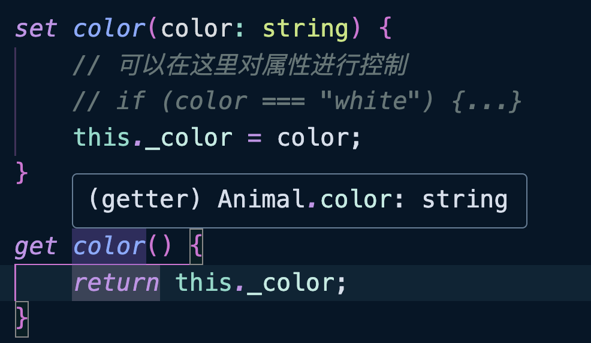

<XTextLight>在 TS 中「类」既可以是类也可以是「类型」，「类」也是一种结构化类型（鸭子类型）。</XTextLight>

在 ES6 之前，JS 使用构造函数来创建类，基于函数的原型来实现继承。但是这样给函数带来了二义性（函数即是一个普通的函数，也是一个类），虽然有一种约定来（函数名首字母大写）区分普通函数和构造函数，但是这种方式并不是强制的，无非从语法层面上进行区分。直到 ES6 引入了箭头函数和`Class`类的语法，才真正的区分了函数和类的语法。

<br />

TS 中类结构和 JS 一样，无非就是属性、构造函数、方法、存取器（访问器）、访问修饰符，装饰器，只需要在这些内容上加上类型标注即可。

属性类似于变量，加上相关的类型标注即可。构造函数、方法、存取器类似于函数，加上参数的类型和返回类型即可。

另外 TS 还进行了拓展，例如抽象类、接口，以及一些访问修饰符，目的是为了让面向对象语法更加的完整。

## 访问修饰符

访问修饰符可以修饰类的属性和方法，主要是以下内容：

+ `public`：默认值，表示可以在类、子类，以及类和子类实例对象上都可以访问的属性和方法；

+ `protected`：表示只可以在类、子类上进行访问的属性和方法；

+ `private`：仅在类的内部可以访问的属性和方法；

<br />

示例：

```typescript
class Animal {
    public name: string;
    protected color: string;
    private _age: number;
    #type: string;
    constructor(name: string, color: string, _age: number, type: string) {
        this.name = name;
        this.color = color;
        this._age = _age;
        this.#type = type;
    }

    show() {
        console.log(this.name, this.color, this._age);
    }
}
```

TS 要求类的属性必须先进行声明，然后才可以使用。

::: tip

TS 配置文件`"strict": true`会默认开启`"strictPropertyInitialization": true`，也就是属性必须初始化，如果要关闭这个特性设置`"strictPropertyInitialization": false`即可（不推荐）。

:::

<br />

`name`、`color`和`_age`的声明方式也可以进行简写：

```typescript
class Animal {
    #type: string;
    constructor(
        public name: string, 
        protected color: string, 
        private _age: number,
        type: string
    ) {
        this.#type = type;
    }
}
```

这样的形式就等同于在类的顶部进行声明类型并在`constructor`内进行赋值。

<br />

示例继承可访问的属性：

```typescript
class Animal {
    #type: string;
    constructor(
        public name: string,
        protected color: string,
        private _age: number,
        type: string
    ) {
        this.#type = type;
    }

    show() {
        console.log(this.name, this.color, this._age);
    }
}

class Cat extends Animal {
    info() {
        // 父类中 public 修饰的属性和方法在子类中都能访问
        console.log(this.name);
        this.show();
      
        // 父类中 protected 修饰的属性和方法在子类中都能访问
        console.log(this.name);
        this.show();

        // 父类中 private 修饰的属性和方法在子类中不能访问
        console.log(this._age); // ❌

        // 父类中使用 # 修饰的属性和方法在子类中不能访问
        console.log(this.#type); // ❌
    }
}

const a = new Animal("小白", "白色", 3, "Dog");
console.log(a.name); // ✅
a.show(); // ✅
console.log(a.color); // ❌
console.log(a._age); // ❌
console.log(a.#type); // ❌

const c = new Cat("小猫", "花色", 2, "Cat");
console.log(c.name); // ✅
c.info(); // ✅
```

根据上面的代码我们可以看出，印证了我们上面对访问修饰符的介绍。

+ 不添加任何修饰符的属性和方法，默认就是`public`的；

+ `#`修饰符是 ES2022 引入的，也是修饰私有属性的，只能在类的内部使用，[详见](https://es6.ruanyifeng.com/#docs/class#%E7%A7%81%E6%9C%89%E6%96%B9%E6%B3%95%E5%92%8C%E7%A7%81%E6%9C%89%E5%B1%9E%E6%80%A7)；

    - `#`修饰符目前不能像 TS 修饰符那样进行构造函数参数的简写；

##  访问器属性

为什么需要访问器属性呢？

可以方便对属性进行操作的时候进行拦截，进行更多的操作。例如判断一个值是否符合范围等等。

<br />

示例代码：

```typescript
class Animal {
    name: string;
    age: number;
    private _color: string;
    #_type: string;

    constructor(name: string, age: number) {
        this.name = name;
        this.age = age;
        this._color = "";
        this.#_type = "";
    }

    set color(color: string) {
        // 可以在这里对属性进行控制
        // if (color === "white") {...}
        this._color = color;
    }

    get color() {
        return this._color;
    }

    set type(type: string) {
        this.#_type = type;
    }

    get type() {
        return this.#_type;
    }
}

let a = new Animal("Jack", 2);
a.color = "white";
console.log(a.color);

a.type = "cat";
console.log(a.type);
```

<br />

访问器属性的写法和 JS 也基本一样，只不过注意几个细节。

1、如果访问器属性定义了`set`方法，则默认情况下，`get`方法的返回值类型应该与`set`方法接收的类型一致。



因此，当一个属性被标记为可选时，将其与`get`和`set`方法同时定义可能会导致逻辑冲突。

```typescript
class Animal{
    ...
    private _color?: string;

    set color(color: string) {
        this._color = color;
    }

    get color() {
        return this._color; // ❌ 不能将类型“string | undefined”分配给类型“string”
    }
}
```

要解决这个错误有很多方式，例如：

+ 删除`_color`的可选修饰；

+ 删除`set`属性访问器（如果`set`是非必需的）；

+ 在`get`中添加对`undefined`的判断；

+ 非空断言；

+ 更改 TS 的配置`"strictNullChecks": false`（不推荐）；


##  静态成员

静态属性和方法和 JS 也基本一致。

示例：

```typescript
class Animal {
    name: string;
    constructor(name: string) {
        this.name = name;
    }

    // 静态属性
    static kingdom = "Animal";

    // 静态方法
    static showKingdom(): string {
        // this 指向类本身，写法不太好，最好使用 Animal，而不是 this
        // 🤔 this: typeof Animal
        console.log(this.kingdom);
        return `The kingdom is ${Animal.kingdom}`;
    }
}

console.log(Animal.showKingdom());
```