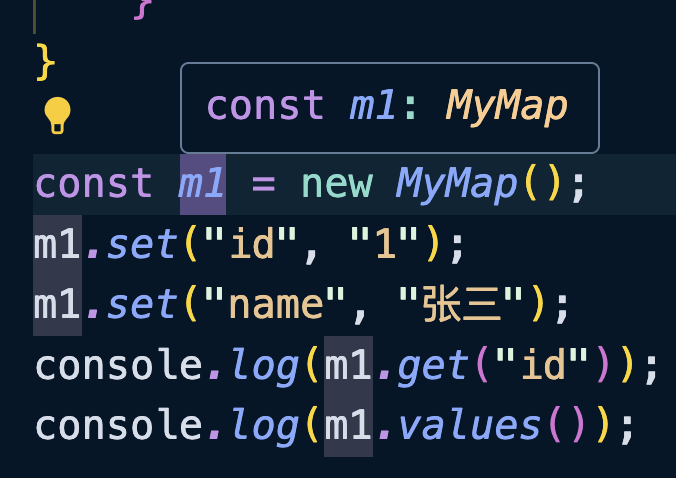

在 TS 中类有两个点需要理解：

1、类是结构化类型，但是需要注意的访问修饰符会触发 TS 类型检查。

示例：

```typescript
class User {
    constructor(
      public id: number, 
      // 公有的
      public name: string, 
      public age: number
    ) {}

    show(address: string) {
        console.log(address);
    }
}

class Person {
    constructor(
      public id: number,
      // 私有的
      private name: string,
      public age: number
    ) {}

    show(address: string) {
        console.log(this.id + "---" + address);
    }
}
```

```typescript
const u = new User(1, "张三", 20);
const p = new Person(2, "李四", 30);
const a = {
    id: 3,
    name: "王五",
    age: 40,
    show(address: string) {
        console.log("hello " + address);
    }
};

function desc(user: User) {
    user.show("北京市");
}

desc(u); // ✅
desc(p); // ❌ 属性“name”在类型“Person”中是私有属性，但在类型“User”中不是
desc(a); // ✅
```

<br />

2、在 TS 中类即声明值也声明类型，而且类的类型有两种：实例化对象类型与类构造函数类型。

```typescript
class MyMap {
    state: Record<string, string> = {};

    get(key: string): string | undefined {
        return this.state[key];
    }

    set(key: string, value: string) {
        this.state[key] = value;
    }

    keys(): string[] {
        return Object.keys(this.state);
    }

    values(): string[] {
        return Object.values(this.state);
    }

    static of(...entries: [string, string][]): MyMap {
        const map = new MyMap();
        entries.forEach((entry) => map.set(entry[0], entry[1]));
        return map;
    }
}

const m1 = new MyMap();
m1.set("id", "1");
m1.set("name", "张三");
console.log(m1.get("id"));
console.log(m1.values());

const m2 = MyMap.of(["id", "1"], ["name", "张三"]);
console.log(m2.keys());
```

注意查看编辑器的提示`m1`的类型是`MyMap`：



上面的代码中，`m1`是`MyMap`类的一个实例。作为实例化后的对象，它可以通过`m1.xxx`来访问对应的属性和方法。

而`new MyMap()`是创建实例时调用的构造函数。既然它是一个值，就应该对应一个值的类型。除此之外，对于类中的静态方法和静态属性，我们可以直接通过`MyMap.xxx`来调用。因此，`MyMap`本身还对应一个类型，这个类型描述的是`MyMap`构造函数的行为和静态成员。

<br />

下面再补充一个示例来说明，例如现在有两个方法，一个方法的参数需要的是一个对象，另外一个方法的参数需要的是类本身，那么这个应该怎么限制呢？

```typescript
class User {
    constructor(public id: number, public name: string) {}
    show() {
        console.log(this.id, this.name);
    }
}

// 接受一个 User 类型的对象
function method1(target: User) {
    console.log(target.id);
    console.log(target.name);
    target.show();
}

// 接受的是一个类的构造函数类型，在函数内不进行实例化
function method2(target: new (...args: [number, string]) => User) {
    const t = new target(1, "jack");
}

method1(new User(1, "jack"));
method2(User);
```

TS 中下面的写法就是构造函数的类型：

```typescript
new (...args:any[]) => any;
```

回到上面案例中，我们如何表示`MyMap`类自身的构造函数类型呢？可以使用`typeof`关键字：

```typescript
type MyMapConstructorType = typeof MyMap;
```

甚至可以通过 TS 的类型工具，`InstanceType<T>`通过构造器类型再得到实例化类型：

```typescript
// 🤔 type MyMapInstanceType = MyMap
type MyMapInstanceType = InstanceType<MyMapConstructorType>;
```

<br />

当然我们并看不见这个类型中具体有哪些，我们可以模仿着 ES 关于类的处理模拟一下`String`、`Map`这些类：

```typescript
// 实例化对象类型
interface MyMap {
    state: Record<string, string>;
    get(key: string): string | undefined;
    set(key: string, value: string): void;
    values(): string[];
    keys(): string[];
}

// 构造函数类型
interface MyMapConstructor {
    new (): MyMap;
    of(...entries: [string, string][]): MyMap;
    readonly prototype: MyMap;
}
```

对于构造函数类型，我们反过来推导一样成立：

```typescript
// 🤔 type M = MyMap
type M = InstanceType<MyMapConstructor>;
```

这里其实可以对应我们 Vue 中的代码，为模版标注类型，可以看到有这样的写法：

```vue
<script>
  import { ref } from "vue"
  import MyComp from "./components/MyComp.vue";

  type MyCompConstructor = typeof MyComp;
  type MyCompInstance = InstanceType<MyCompConstructor>;
  const myComp = ref<MyCompInstance | null>(null)
  // 简写
  // const myComp = ref<InstanceType<typeof MyComp> | null>(null)

  const openModal = () => {
    myComp.value?.open();
  }
</script>

<template>
  <MyComp ref="myComp"/>
</template>  
```

`MyComp`实际得到的是 Vue 的配置对象，其实就相当于 MyComp.vue 文件中所写在`<script>`中的内容，包括`data`，`methods`，生命周期函数等等。

通过`typeof MyComp`其实得到了 Vue 组件的构造函数类型，然后再通过`InstanceType<MyCompConstructor>`得到真正的 Vue 实例对象类型，有了这样的类型之后，我们才能在声明的变量中访问到`MyComp`暴露出来的方法。