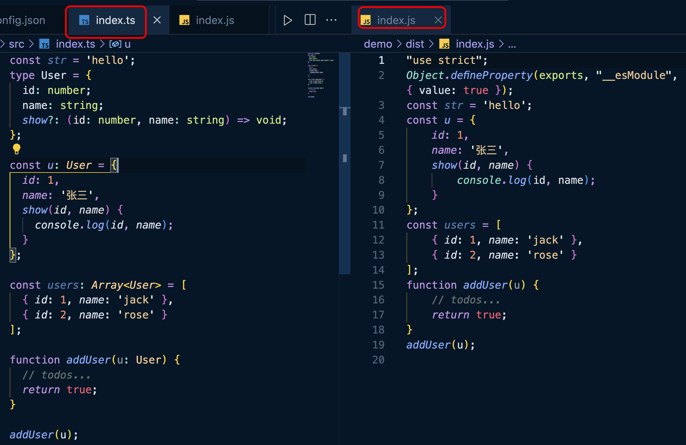
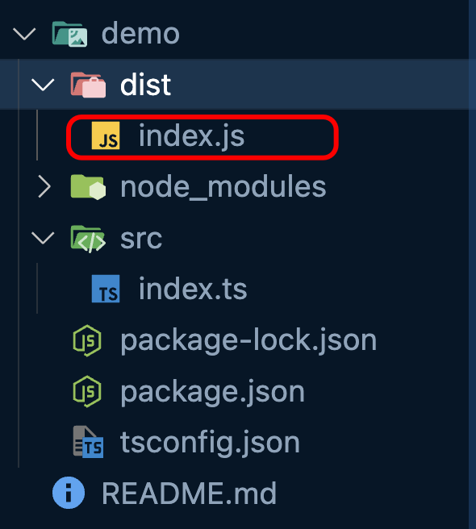
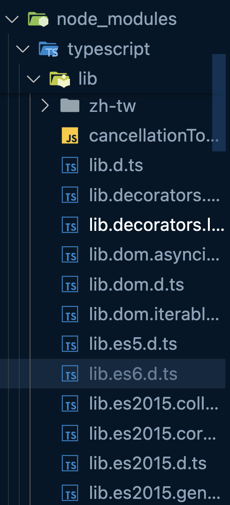
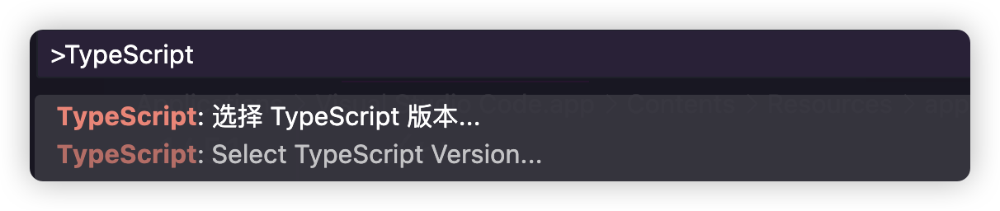
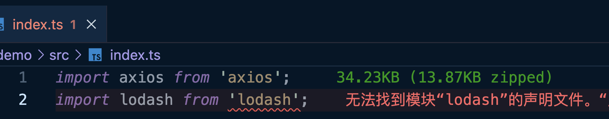
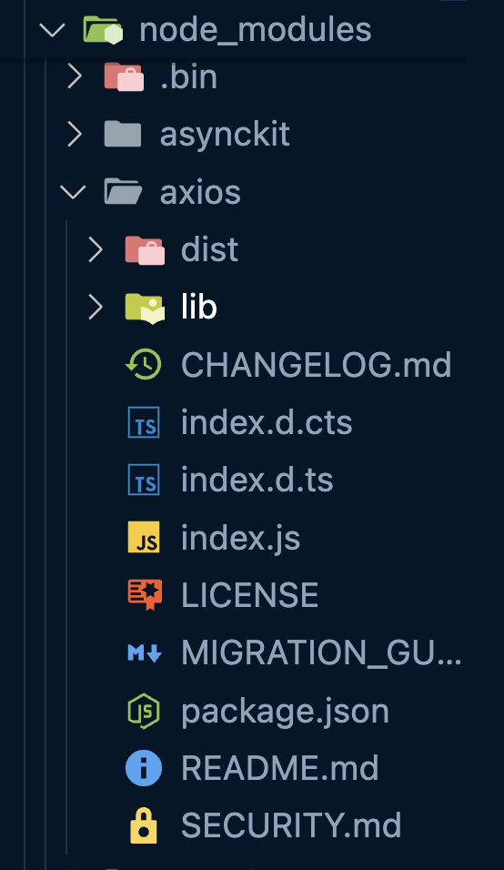
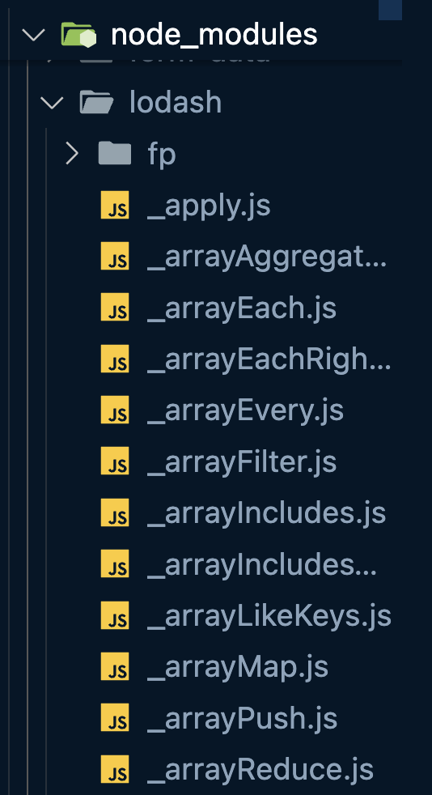
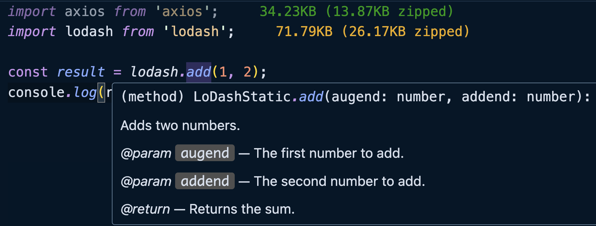

TS 的类型声明文件是一个`xx.d.ts`的文件，这个文件的作用是为 JavaScript 库（例如 jQuery、Lodash）、模块、全局变量等提供类型定义信息。

使开发者能够得到很好的类型提示：

```typescript
// node_modules/Lodash/index.d.ts

declare module 'lodash' {
  export function chunk<T>(array: T[], size?: number): T[][];
}
```

```typescript
// demo/src/index.ts

// 使用时有类型提示
import { chunk } from 'lodash';
const result = chunk([1, 2, 3, 4], 2); // result 推断为 number[][]
```

（具体的 TS 模块解析策略后面讲解）。


但是我的项目在 TS 中编译后的 JS 文件是没有具体的类型的，只有具体的 JS 逻辑：



编译后的结果文件也没有其他的文件：




如果我们想要得到编译后的 .d.ts 文件需要更改 tsconfig.json 的配置：

```json
{
  "compilerOptions": {
    // ...
    "declaration": true,	/* 为项目中的 TypeScript 和 JavaScript 文件生成 .d.ts 声明文件。 */
    "declarationDir": "./types", /* 指定 .d.ts 文件的输出位置 */
  }
}
```

<br/>warning
⚠️ 注意

姑且不要把`compilerOptions.module`属性配置为任何内容，因为会影响`declaration`的结果。

<br/>


接着只要运行 TS 的命令即可完成编译：

```bash
$ npx tsc
```


最终就会在 ./types 下面得到 index.d.ts 文件：

```typescript
// index.d.ts

declare const str = "hello";
type User = {
  id: number;
  name: string;
  show?: (id: number, name: string) => void;
};
declare const u: User;
declare const users: Array<User>;
declare function addUser(u: User): boolean;
```

也就是说，类型并不是真正的消失了，而是被放到了专门的类型声明文件里面。.d.ts 结尾的文件就是类型声明文件。


其实 TypeScript 本身就包含两种文件类型：

+ .ts 文件：即包含类型信息，又包含可执行的代码，可以被编译为 .js 文件后执行，主要是我们编写文件代码的地方；
+ .d.ts 文件：只包含类型信息的类型声明文件，不会被编译为 .js 文件代码。仅仅是提供类型信息，所以类型文件的用于就是提供类型信息；


## <font style="background-color:#74B602;"> </font> 类型声明文件的来源
类型声明文件主要有以下三种来源：

+ Typescript 编译器自动生成；
+ Typescript 内置类型文件；
+ 外部模块的类型声明文件，需要自己安装；


### 自动生成
只要使用`compilerOptions.declaration`选项，编译器就会在编译的时候自动生成单独的类型声明文件。

```json
{
  "compilerOptions": {
    "declaration": true
  }
}
```

`declaration`这个属性还与其他属性具有某些关联性：

+ `declarationDir`：指定生成的声明文件 .d.ts 的输出目录；
+ `emitDeclarationOnly`：只输出 .d.ts 文件，不输出 JavaScript 文件；
+ `declarationMap`：为 .d.ts 文件创建源映射；


### 内置声明文件
我们在项目中安装 TypeScript 的时候，会同时被安装一些内置的声明文件，主要是内置的全局对象（JavaScript 语言接口和运行环境 API）的类型声明。这就是为什么`string`、`number`等等基础类型，JavaScript 的 API 直接就有类型声明的原因。

声明文件位于 TypeScript 的 lib 目录下：




tsconfig.json 文件中配置的`target`和`lib`其实是和内置的声明文件具有关系的。Typescript 编译器会自动根据编译目标`target`的值，加载对应的内置声明文件，默认不需要特别的配置。

例如：

```json
{
  "compilerOptions": {
    "lib":["es2020","dom","dom.iterable"]
  }
}
```

<br/>tips
❕信息

为什么我们没有安装 Typescript 之前也有提示？

这是由于我们的 VS Code 等IDE工具在安装或者更新的时候，已经内置了 Typescript 的 lib。一般在VS Code安装路径/resources/app/extensios/node_modules/typescript下。

如果你的 VS Code 一直没有升级，就有可能导致本地 VS Code 的 Typescript 版本跟不上的情况，如果你的项目目录下，也安装的有 Typescript，我们是可以进行切换的。

在 VS Code 中使用快捷键`ctrl(command) + shift + P`，输入 TypeScript:



你可以选择使用 VS Code 版本还是项目工作区的版本。

<br/>


### 外部类型声明文件
如果我们的项目是用来 npm 上的某个包，那么就需要这个包的类型声明文件。这个时候又分成了三种情况：

1、这个包自带了类型声明文件；

2、社区制作的类型声明文件；

3、没有类型声明文件；

对于第 3 点我们不需要过度的纠结，关键是第 1、2 点的情况是什么意思呢？


例如我们安装一下`axios`、`lodash`这两个包。

```bash
$ npm i axios lodash
```

<br/>warning
⚠️ 注意

引入模块之前，涉及到 TS 的模块解析策略，因此需要在 tsconfig.json 中需要配置一下`module`

对于现代 Node.js 项目，我们可以配置`"module": "NodeNext"`，注意这个配置会影响下面的配置：

+ `"moduleResolution": "NodeNext"`，指定 TypeScript 查找模块规范符时的解析策略；
+ `"esModuleInterop": true`


当然，具体模块化的配置，不同的环境要求是不一样的，有一定的区别，这里先不深入探讨。

<br/>


当我导入这两个包的时候，对于`lodash`包 TS 就会提示错误：



当我们打开 node_modules 下这两个包的目录的时候就会发现，`axios`这个包是有 .d.ts 类型声明文件的，`lodash`则没有，也就是说根本没有类型声明文件：



所以 TS 就会提示找不到`lodash`的模块声明文件。


对于这种本身不带类型声明的文件的包，社区往往会提供。Typescript 社区主要使用 [DefinitelyTyped](https://github.com/DefinitelyTyped/DefinitelyTyped/blob/master/README.zh-Hans.md)，可以到那里去找一下对应的包是否有类型声明文件（或者直接到 npm 的官网去搜索）。

对于社区支持的包的类型声明文件通常都是以`@types/`开头的，例如`@types/lodash`，`@types/jquery`，`@types/node`，`@types/react`，`@types/react-dom`等等。


回归上面的错误，我们就可以安装一个`@types/lodash`的包来让 TS 正确的识别`lodash`的类型。

```bash
$ npm i --save-dev @types/lodash
```

之后编辑器就不会提示错误，并且可以获得对应的类型提示：




默认情况下，TypeScript 会自动包含所有项目中能找到的`@types`包，不仅是在项目的 node_modules/@types 文件夹中，还会往上级目录去找。这意味着如果你的项目目录中没有找到类型定义文件，但上级目录有 node_modules/@types 文件夹，那么这些类型声明也会被自动引入进来。

可以通过`compilerOptions.typeRoots`选项设置查找的文件路径，如果指定了`typeRoots`，则只会包含`typeRoots`下的包。例如：

```json
{
  "compilerOptions": {
    "typeRoots": ["./typings", "./vendor/types"]
  }
}
```

配置后将只会包含 ./typings 和 ./vendor/types 下的所有包，但不会包含 ./node_modules/@types 下的任何包。


## <font style="background-color:#74B602;"> </font> 总结
类型声明文件的用途：

1、自己写了一个主要是 Javascript 代码的第三方库，需要给这写 Javascript 代码加上类型声明，以便用户使用的时候可以得到类型声明，方便调用 API。

2、自己下载了别人写的第三方库，但是没有 Typescript 类型声明，在社区 [DefinitelyTyped](https://gitee.com/link?target=https%3A%2F%2Fgithub.com%2FDefinitelyTyped%2FDefinitelyTyped) 中也没有找到对应的类型声明，但是我们一定要用这个库，可以手动为这个库添加一些简单的类型声明，以免我们自己项目在使用这个第三方库没有类型声明报出错误提示。

3、在做应用项目的时候，需要补充一些全局的类型声明的时候，我们可能需要自己动手写 .d.ts 文件，其实这种情况大多数还是和第 2 点有关系。

