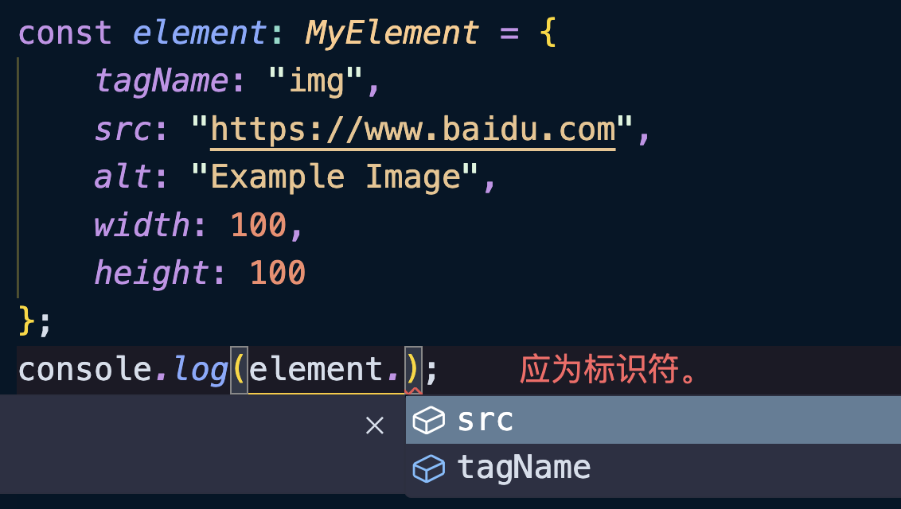
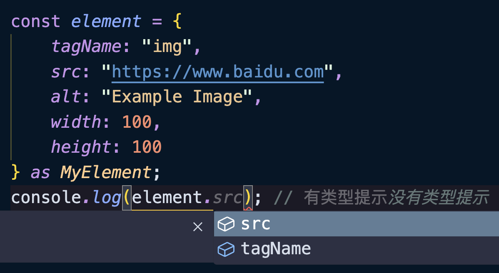
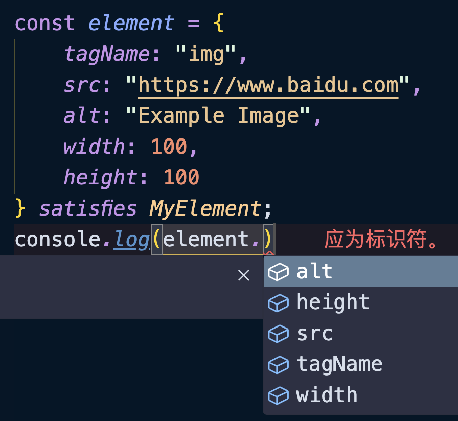

`satisfies`是一个类型操作符，它是 TS@4.9 的新功能，和类型断言`as`功能比较类似，但是比类型断言更加安全也更加智能，因为它能在满足类型安全的前提下，自动帮我们做类型收缩和类型提示。

```typescript
interface IConfig {
    a: string | number;
}

const elgacy: IConfig = {}; // ❌ 类型 "{}" 中缺少属性 "a"，但类型 "IConfig" 中需要该属性
console.log(elgacy.a); // ✅ 可以正常提示，不报错
```

以上代码中，我们将`elgacy`设置为`IConfig`后，访问`.a`属性并不会报错。

我们也可以强制将`{}`断言为`IConfig`类型，这样也不会报错：

```typescript
interface IConfig {
    a: string | number;
}

const elgacyAs = {} as IConfig; // ✅ 可以正常提示
console.log(elgacyAs.a); // ✅ 可以正常提示
```

当我们使用`as`断言后就不会出现错误了，但是肯定是存在类型安全问题的，如果使用`satisfies`类型券就会得到保证：

```typescript
interface IConfig {
    a: string | number;
}

const elgacyAs = {} satisfies IConfig; // ❌ 类型 "{}" 中缺少属性 "a"，但类型 "IConfig" 中需要该属性
console.log(elgacyAs.a); // ❌ 类型“{}”上不存在属性“a”
```

<br />

另外`satisfies`比`as`也更加的智能，它可以自动帮我们推断出声明的类型，而不是联合类型：

```typescript
interface IConfig {
    a: string | number;
}

const currentWithValue: IConfig = { a: 2 };
currentWithValue.a.toFixed(); // ❌ 类型“string”上不存在属性“toFixed”

// 🤔 const currentWithValue2: IConfig
const currentWithValue2 = { a: 2 } as IConfig;
currentWithValue2.a.toFixed(); // ❌ 类型“string”上不存在属性“toFixed”

// 🤔 const currentWithValue3: { a: number; }
const currentWithValue3 = { a: 2 } satisfies IConfig;
currentWithValue3.a.toFixed(); // ✅ 可以正常提示
```

<br />

再比如在某些映射类型中，编辑器不会出现任何的属性提示：

```typescript
type MyElement = {
    tagName: string;
    src: string;
    [key: string]: any;
};
```



如果我们想访问`.alt`属性，编辑器不会出现提示。

使用`as`类型断言也是如此：



<br />

但是如果使用的是`satisfies`就会非常的智能：

