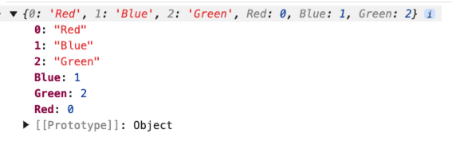

我们为什么要使用枚举？

使用枚举是为了让代码更有意义、更易读，并减少错误。它可以帮我们用清晰的名字代替杂乱的数字或字符串，代码更易读、更安全，也更容易维护。

比如我们要定义春夏秋冬、颜色、月份、星期、方向等等有序列或者比较固定的离散值的情况。在 JS 中我们会想到用`const`定义一系列的常量，在 TS 中我们会想到使用联合类型进行处理：

```typescript
// 使用联合类型定义枚举
type Gender = "男" | "女";
type Color = "red" | "blue" | "green";
type Direction = "up" | "down" | "left" | "right";
type Status = "success" | "error" | "warning";
type Weekday = "Sun" | "Mon" | "Tue" | "Wed" | "Thu" | "Fri" | "Sat";

function fn1(color: Color) {
    switch (color) {
        case "red":
            console.log(color);
            // todo...
            break;
        case "blue":
            console.log(color);
            // todo...
            break;
        case "green":
            console.log(color);
            // todo...
            break;
    }
}
```

但是如何这么写会出现一些问题，也就是逻辑含义`switch`和类型`type`产生了混淆，会导致修改类型的时候，产生大量的修改。

示例：

```typescript
type Color = "red" | "blue" | "green";
// 修改为
type Color = "红" | "蓝" | "绿";
```

这样改完后不仅仅是声明要更改，整个的`switch`判断也需要修改，所以才出现了 TS 的枚举类型。

<br />

枚举类型是一个特殊的类型，枚举类型既可以当做类型也可以当做值。之前讲述的类型在编译后就会被去除，而枚举类型在编译后会被保留下来，枚举类型可以参与逻辑业务。

在 TS 中枚举通常都是首字母大写的，枚举的值默认从 0 开始递增：

```typescript
// 枚举创建好之后，本身就有映射
// 字符串=》数字 字符串=》字符串
enum Color {
    Red = 0,
    Blue = 1,
    Green = 2
}

function foo(color: Color) {
    switch (color) {
        case Color.Red:
            console.log(color);
            break;
        case Color.Blue:
            console.log(color);
            break;
        case Color.Green:
            console.log(color);
            break;
    }
}

foo(Color.Green);
```

枚举类型编译后的结果：

```typescript
"use strict";
Object.defineProperty(exports, "__esModule", { value: true });
var Color;
(function (Color) {
    Color[Color["Red"] = 0] = "Red";
    Color[Color["Blue"] = 1] = "Blue";
    Color[Color["Green"] = 2] = "Green";
})(Color || (Color = {}));
function foo(color) {
    switch (color) {
        case Color.Red:
            console.log(color);
            break;
        case Color.Blue:
            console.log(color);
            break;
        case Color.Green:
            console.log(color);
            break;
    }
}
foo(Color.Green);
```

枚举对象结构：



<br />

一般情况下，如果一个枚举的值是`number`，则其他枚举值会自动的递增：

```typescript
enum Color {
    Red = 100,
    Blue, // 🤔 Color.Blue = 101
    Green = 2,
    Yellow // 🤔 Color.Yellow = 3
}
```

如果枚举值都是字符串，则需要手动指明值，因为 TS 不知道后续的值应该是什么：

```typescript
enum Color {
    Red = "red",
    Blue = "blue",
    Green // ❌ 枚举成员必须具有初始化表达式
}
```

当然，枚举的值也可以是数值和字符串混合，这种一般称为「异构枚举」，这种方式不推荐：

```typescript
enum Color {
  Red = 100,
  Blue = "blue",
  Green = 100 + 200,
  Yellow = "yellow"
}
```


##   双向映射
枚举和对象的差异还在于，对象是单向映射的（只能从键映射到键），而枚举是双向映射的（即可以从枚举成员映射到枚举值，也可以从枚举值映射到枚举成员）：

```typescript
enum Direction {
    Up,
    Down,
    Left,
    Right
}
const upValue = Direction.Up;
console.log(upValue); // 0

const upKey = Direction[0];
console.log(upKey); // Up
```

这主要就是因为我们前面讲述的枚举的编译结果下面的方式：

```javascript
var Direction;
(function (Direction) {
    Direction[Direction["Up"] = 0] = "Up";
    Direction[Direction["Down"] = 1] = "Down";
    Direction[Direction["Left"] = 2] = "Left";
    Direction[Direction["Right"] = 3] = "Right";
})(Direction || (Direction = {}));
const upValue = Direction.Up;
console.log(upValue); // 0
const upKey = Direction[0];
console.log(upKey); // Up
```

以上代码中，`obj[k] = v`的返回值即是`v`，因此这里的`obj[obj[k] = v] = k`本质上就是进行了 `obj[k] = v`与`obj[v] = k`这样两次赋值。

<XTextLight>但是需要注意，只有值为数字的枚举成员才可以进行双向映射，字符串枚举成员仍然是单向的：</XTextLight>

```typescript
enum Direction { 
  Up = 0,
  Down = 1,
  Left = "left",
  Right = "right"
}
```

编译之后：

```javascript
var Direction;
(function (Direction) {
    Direction[Direction["Up"] = 0] = "Up";
    Direction[Direction["Down"] = 1] = "Down";
    Direction["Left"] = "left";
    Direction["Right"] = "right";
})(Direction || (Direction = {}));
```

##   常量枚举
如果我们希望屏蔽不安全的访问操作，可以使用「常量枚举」：

```typescript
const enum Direction {
    Up = 0,
    Down = 1,
    Left = 2,
    Right = 3
}

console.log(Direction[0]) // ❌ 不能反向查找
console.log(Direction.Up); // 0
```

使用常量枚举需要注意：

+ 常量枚举不允许反向查找；
+ 常量枚举默认不会产生任何的 JS 代码，而是在使用到枚举成员的时候直接插入对应的值；

```javascript
"use strict";
Object.defineProperty(exports, "__esModule", { value: true });
console.log(Direction[0]); // ❌ 不能反向查找
console.log(0 /* Direction.Up */); // 0
```

##   isolatedModules
如果在工程中使用枚举类型，务必要设置 tsconfig 的属性`isolatedModules:true`，因为有些打包工具并没有依赖 Typescript 的`tsc`进行类型检查和类型转译，像`esbuild`和`Babel`这样的工具会单独编译每个文件，因此它们无法判断导入的名称是类型还是值。

所以有一些 Typescript 的特性是容易产生错误的，比如`const enum`。这个内容在 [vite](https://gitee.com/link?target=https%3A%2F%2Fcn.vitejs.dev%2Fguide%2Ffeatures.html%23isolatedmodules) 和[esbuild](https://gitee.com/link?target=https%3A%2F%2Fesbuild.github.io%2Fcontent-types%2F%23isolated-modules) 中都有相关的说明。

