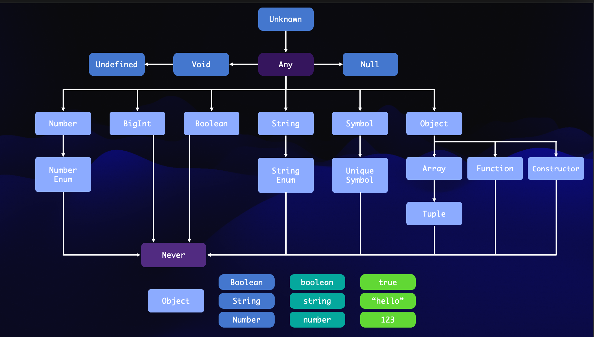

什么是类型系统？

简单说类型系统就是类型检查器为程序分配类型时候使用的一系列规则，并在编译或运行时检查和限制这些类型的使用。


类型系统的分类可以分为如下两种：

+ 通过显式语句告诉编译器所有值的类型；
+ 编译器自动推导出值得类型；


不同语言的类型系统：

+ JavaScript、Python、Ruby...
    - 运行时推导类型；
+ Haskell、OCaml...
    - 编译时推导和检查类型；
+ Java、C...
    - 显示注解所有类型，编译时检查;
+ TypeScript
    - 显示声明部分类型，编译时推导和检查剩余部分;


在 TS 中类型系统是存在一个父子关系的：



一般来说：

+ 子类型（Subtype）：一种类型 T1 是另一种类型 T2 的子类型，表示 T1 可以赋值给 T2，并且这种赋值是类型安全的。
+ 父类型（Supertype）：一种类型 T2 是另一种类型 T1 的父类型，表示 T1 可以赋值给 T2。


也就是说子类型能给父类型赋值，但是反过来不行：

```typescript
let greeting: string = "hello";
const specificGreeting: "hello" = "hello";

greeting = specificGreeting; // OK（字面量类型是 string 的子类型）
specificGreeting = greeting; // ❌（string 不能赋值给字面量类型 "hello"）
```

```typescript
interface Person {
  name: string;
}

interface Employee extends Person {
  employeeId: number;
}

const person: Person = { name: "Alice" };
const employee: Employee = { name: "Bob", employeeId: 123 };

// 子类型赋值给父类型（安全）
const anotherPerson: Person = employee; // OK

// 父类型赋值给子类型（不安全，编译报错）
const anotherEmployee: Employee = person; // ❌ Property 'employeeId' is missing
```


在 TypeScript 中，`undefined`和`null`是独立的基础类型。默认情况下，`undefined`是所有类型的子类型，除非开启`strictNullChecks`。

```typescript
let value: string | undefined = "test";
value = undefined; // OK

let anotherValue: number | null = 100;
anotherValue = null; // OK

// 在开启 strictNullChecks 时，以下会报错：
let name: string = null; // Error
```

