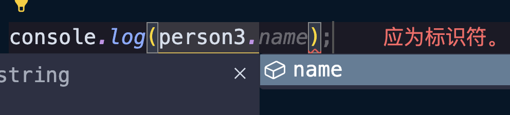

某些时候一个类型可能是`string`，也可能是`number`，或者这个类型不仅仅是一个类型字面量的值，我们希望可以限定是多个值，那么这个时候我们就可以使用联合类型：

```typescript
// number 和 string 类型联合
type Width = number | string;
const width1: Width = 100;
const width2: Width = "100px";

// Color 是三种字面量类型
type Color = "red" | "blue" | "green";
const color1: Color = "red";
const color2: Color = "blue";
const color3: Color = "green";
```

同样的，如果是对象字面量类型也可以：

```typescript
type Student = { name: string, score: number };
type Teacher = { name: string, age: number, subject: string };
// Student 和 Teacher 类型联合
type Person = Student | Teacher;

const person1: Person = { name: "jack", score: 100 };
const person2: Person = { name: "jack", age: 18, subject: "math" };
const person3: Person = { name: "jack", age: 18, subject: "math", score: 100 };
const person4: Person = { name: "jack" }; // ❌ 不能将类型“{ name: string; }”分配给类型“Person”
```

由于是联合类型，从上面的代码可以看出`Person`类型可以是`Student`类型的值，也可以是`Teacher`类型的值，甚至两者兼具结构的值也可以（例如`person3`）。当然，变量的值不能都不满足两个类型（例如`person4`）。

<br />

但是使用对象字面量的联合类型取值的数据就会出现问题：



```typescript
console.log(person3.name);
console.log(person3.age);   // ❌ 类型Person上不存在属性age
console.log(person3.score); // ❌ 类型Person上不存在属性score
```

你会发现编辑器只会提示出`name`这一个属性，而访问其他的属性就会异常。

这是因为`Student`类型有的属性，`Teacher`类型的属性不一样有，反过来也是一样，所以只会取两个类型的交集，这是对于安全性的考虑。

如果非要进行获取就需要使用类型断言或者非空断言：

```typescript
console.log(person3.name);
console.log((person3 as Teacher).age); // ✅
console.log((person3 as Student).score); // ✅
```

<br />

另外，联合类型无论是在声明类型别名，对象字面量或者函数中都可以用到：

```typescript
type Color = "黑色" | "白色" | "褐色" | "花色";
type Breed = "英短" | "中华田园猫" | "暹罗猫" | "孟买猫";
type Cat = {
    name: string;
    age: number;
    gender: "公猫" | "母猫";
    color?: Color; // 使用 Color 的联合类型
    breed?: Breed; // 使用 Breed 的联合类型
};

const cat: Cat = {
    name: "Tom",
    age: 11,
    gender: "公猫",
    color: "黑色"
};
cat.breed = "中华田园猫";
```

```typescript
function foo(x: number | string) {
  if (Math.random() > 0.5) {
    return Number(x) * 2;
  }
}
```

