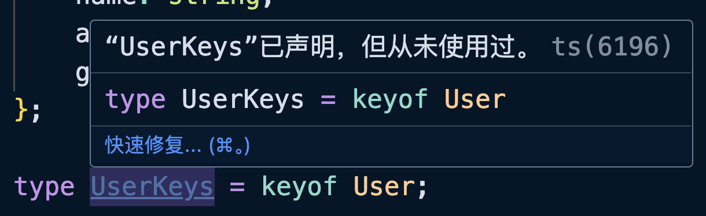
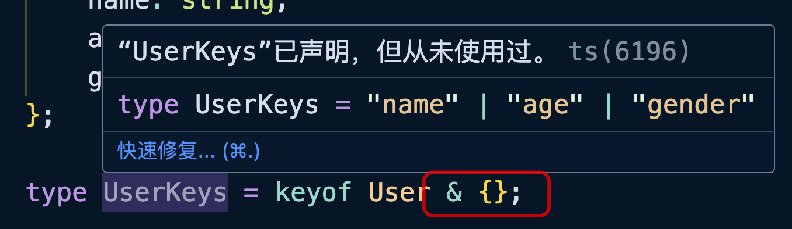
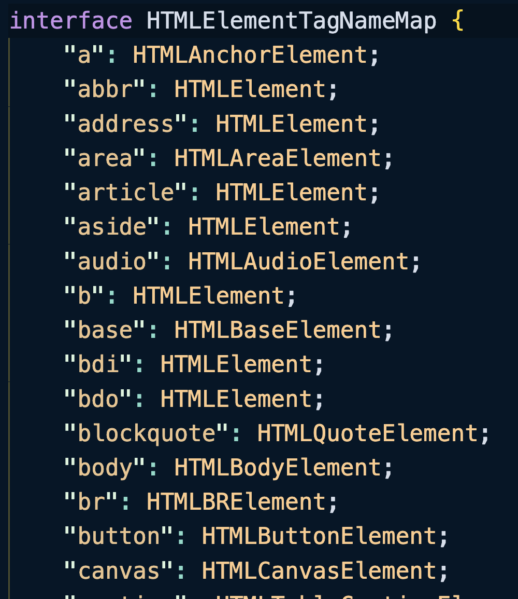

`keyof`操作符可以获取对象类型的 Key 并返回一个联合类型。

```typescript
type User = {
    name: string;
    age: number;
    gender: "男" | "女";
};
// 🤔 type UserKeys = "name" | "age" | "gender";
type UserKeys = keyof User;
```


::: tip

默认情况下，我们在编辑器中是无法看到`UserKeys`具体的结果的。



可以在`keyof User`后面加上一个交叉类型，这样就可以看到结果了。



:::

<br/>

`keyof`也可以和方括号运算符联合使用，来获取对象类型中所有的属性类型：

```typescript
type Person = {
    age: number;
    name: string;
    sex: boolean;
};

// 🤔 type A = string | number | boolean
type A = Person[keyof Person];
```

<br/>

结合泛型、方括号运算符以及`extends`受限的泛型，可以直接重构之前案例中的代码：

```typescript
// before

function createElement(tagName: "div"): HTMLDivElement;
function createElement(tagName: "span"): HTMLSpanElement;
function createElement(tagName: string): HTMLElement {
    return document.createElement(tagName);
}
```

```typescript
// after

// 🤔 "object" | "a" | "abbr" | "address" | "area" ...
type TagName = keyof HTMLElementTagNameMap & {};
function createElement<T extends TagName>(tagName: T): HTMLElementTagNameMap[T] {
    return document.createElement(tagName);
}

// 🤔 let res: HTMLInputElement
let res = createElement("input")
```

这个示例中直接之前函数重载的案例进行了优化，使用`keyof`来得到`HTMLElementTagNameMap`中所有的联合类型，使用`extends`限制了`T`的类型只能是联合类型，最后返回`HTMLElementTagNameMap[T]`对应的属性类型。

<br/>

`HTMLElementTagNameMap`接口如下：



