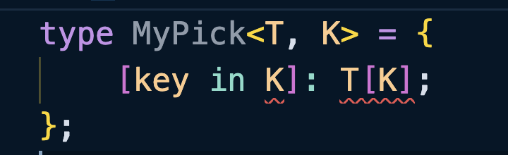
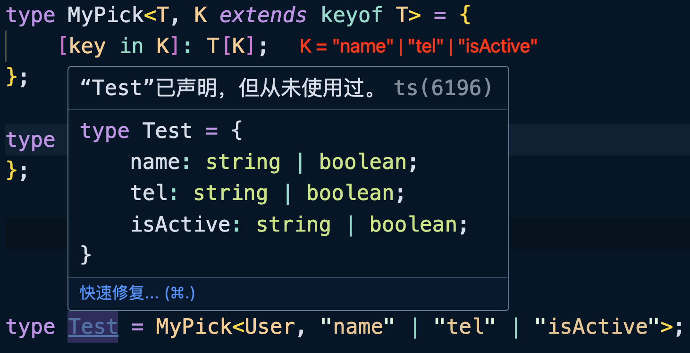

如果希望实现这么一个效果：在原有对象类型的属性上选取特定的属性并生成一个新的类型：

```typescript
type User = {
    readonly id: number;
    name: string;
    tel: string;
    address?: string;
};

// 比如挑选 name 和 tel 属性，形成下面的类型
type UserPick = {
    name: string;
    tel: string;
};
```

那么应该如何编写这个类型工具呢？

```typescript
type MyPick<T, K> = {
    [key in K]: T[key]; 
    // ❌ 不能将类型“K”分配给类型“string | number | symbol”
    // ❌ 类型“key”无法用于索引类型“T”
};
```

上面的示例中会产生两个错误：



首先看第一个错误，这个错误的意思是`K`的类型太宽泛了，而对象类型的键只能是`“string | number | symbol”`联合类型中的某一个。这个错误可以把`K`的范围限制为`keyof any`就可以得到解决：

```typescript
type MyPick<T, K extends keyof any> = {
    [key in K]: T[key]; 
};
```

`keyof any`会得到一个联合类型：`“string | number | symbol”`，这也正好符合对象类型的键只能是`“string | number | symbol”`的要求。

再第二个错误的原因是 TS 无法确保`K`一定是`T`这个类型的键，所以抛出的错误。那我们就想如果将`K`的的范围再限制一下，限制`K`的类型必须是`T`中的某个属性不就可以了嘛。

```typescript
type MyPick<T, K extends keyof T> = {
    [key in K]: T[key];
};
```

这样这个类型工具就不会产生错误了：

```typescript
type User = {
    readonly id: number;
    name: string;
    tel: string;
    isActive: boolean;
    address?: string;
};

type Test = MyPick<User, "name" | "tel" | "isActive">;

/* 
    type Test = {
        name: string;
        tel: string;
        isActive: boolean;
    }
*/
```

<br />

::: warning

`[key in K]: T[key];`中不要使用`T[K]`，因为`K`是一个联合类型，`T[K]`得到的也就是联合类型。



使用`T[key]`的时候才表示某个具体的键。

:::