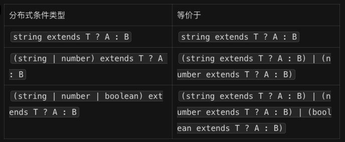

「条件类型」再结合「联合类型」+「泛型」使用的时候，会触发「分布式条件特性」。



我们之前写过一个`IsString`的类型工具：

```typescript
type IsString<T> = T extends string ? true : false;

type A = IsString<string>; // true
type B = IsString<number>; // false
type C = IsString<"abc">; // true
type D = IsString<123>; // false
```

如果我们传递给`IsString`的是一个联合类型，那么就会触发分布式特性。

```typescript
type IsString<T> = T extends string ? 1 : 2;
// 🤔 type E = 1 | 2
type E = IsString<"a" | true | 1>; 
```

触发分布式特性后得到的是一个联合类型，就相当于是`"a" | true | 1`依次和`extends string`进行兼容比较。

如果条件类型返回的`true | false`，那么得到的其实是一个`boolean`类型，而不是联合类型：

```typescript
type IsString<T> = T extends string ? 1 : 2;
// 🤔 type F = boolean
type F = IsString<"a" | true | 1>; 
```

<br />

我们可以写的更加灵活一点，将`string`也抽离为一个泛型：

```typescript
type MyInclude<T, U> = T extends U ? T : never;

type A = "a" | "b" | "c";
type B = "a" | "b";
type C = MyInclude<A, B>; // "a" | "b"
```

其实`MyInclude`就相当于做了下面的操作：

```typescript
type C = MyInclude<"a", "a" | "b"> | MyInclude<"b", "a" | "b"> | MyInclude<"c", "a" | "b">;

// 替换为更加具体的类型，方便理解

type C = ("a" extends "a" | "b" ? "a" : never)
	| ("b" extends "a" | "b" ? "b" : never)
	| ("c" extends "a" | "b" ? "c" : never);
```

所以最终得到的结果其实是：

```typescript
type C = "a" | "b" | never;
```

只不过最后根据`never`的特性（任何值都不能赋值给`never`）直接被移除了。

上面的`MyInclude`示例也可以将`T`和`never`的位置互换一下，得到一个排除的效果：

```typescript
type MyExclude<T, U> = T extends U ? never : T;

type A = "a" | "b" | "c";
type B = "a" | "b";
type C = MyExclude<A, B>; // c
```

<br />

我们实现的`MyInclude`和`MyExclude`其实就是官方工具类型`Exclude<UnionType, ExcludedMembers>`和`Extract<Type, Union>`的实现方式。

`Exclude`和`Extract`搭配上`Pick`还能实现出和`Pick`工具相反的效果。

```typescript
// MyOmit 先将 T 中 K 的属性移除掉，得到 "name"
// 然后在调用 Pick<T, "name"> 获取 name 属性的类型
type MyOmit<T, K extends keyof any> = Pick<T, Exclude<keyof T, K>>;

type Foo = {
    name: string;
    age: number;
};

type Bar = MyOmit<Foo, "age">; //{ name: string }
```

其实`MyOmit`的实现，其实就是官方工具类型`Omit<Type, Keys>`的实现。

<br />

我们也可以做个工具来练习一下官方的类型工具，例如下面的对象字面量类型：

```typescript
type User = {
    id: number;
    name: string;
    age: number;
    tel: string;
    address: string;
};
```

我希望实现一个类型工具，可以将选择的键名设置为可选的属性，例如将`tel`和`address`设置为可选的属性：

```typescript
type User = {
    id: number;
    name: string;
    age: number;
    tel?: string;
    address?: string;
};
```

如何做呢？首先我们应该过滤出哪些是必选的属性，哪些是可选的属性。要得到必须的属性，那我使用`Omit`这个工具类型将可选的类型排除出去，然后得到一个新的类型不就可以了嘛：

```typescript
type RequiredPick = Omit<User, "tel" | "address">;

/*
  type RequiredPick = {
      id: number;
      name: string;
      age: number;
  }
*/
```

我可以使用`Pick`来根据传入的 Keys 获取对象指定的 Keys 并返回一个新的类型：

```typescript
type OptionalPick = Pick<User, "tel" | "address">;

/*
  type OptionalPick = {
      tel: string;
      address: string;
  }
*/
```

最后再使用`Partial`这个工具类型将`OptionalPick`的类型全部设置为可选的属性：

```typescript
type PartialPick = Partial<OptionalPick>;

/*
  type PartialPick = {
      tel?: string | undefined;
      address?: string | undefined;
  }
*/
```

最后将`RequiredPick`和`PartialPick`两个类型进行交叉即可:

```typescript
type FinalPick = RequiredPick & PartialPick;

const user: FinalPick = {
    id: 1,
    name: "zhangsan",
    age: 18,
};
```

最后我们可以使用泛型来把这个案例进行优化一下，让其更加的通用：

```typescript
type OptionalPick<T, K extends keyof T> = 
  Omit<T, K> & Partial<Pick<T, K>>; 

const user: OptionalPick<User, "tel" | "address"> = {
    id: 1,
    name: "zhangsan",
    age: 18,
};
```

其实可以把 TS 的类型工具类比为 JS 的函数，`Omit`“函数”是用来移除属性的，`Partial`“函数”是用来将属性转换为可选属性的，`Pick`“函数”是用来提取属性的。

<br />

最后，还需要强调一下触发分布式条件类型需要注意两点：

1、类型参数需要通过反省参数的方式传入，写死是不行的

```typescript
// 始终都是 "no"
type A = string | number | boolean extends string | number ? "yes" : "no";  
```

2、类型参数需要是一个泛型，并且条件类型中的泛型参数不能被包裹。

```typescript
type B<T> = T extends any ? T[] : never;
type C<T> = [T] extends any ? T[] : never;

type D = B<string | number>;  // string[] | number[]
type E = C<string | number>;  // (string | number)[]
```