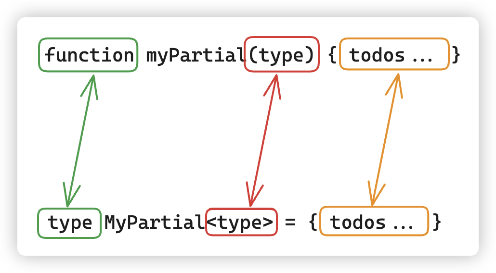
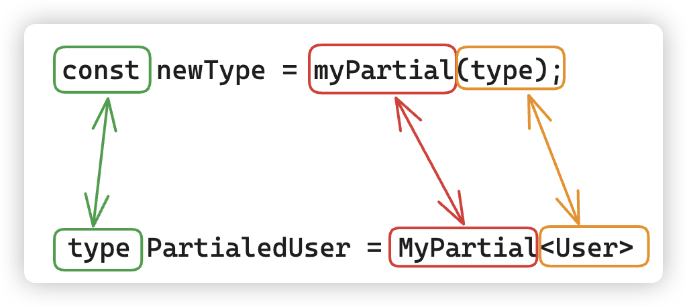

## 属性修饰符
我们的类型编程代码已经逐步过渡成对泛型的处理：

```typescript
type User = {
    readonly id: number;
    name: string;
    tel: string;
    address?: string;
}

type CopyUser = {
    [key in keyof User]: User[key]
}
// 优化
type Copy<T extends object> = {
    [key in keyof T]: T[key]
}
```

<br />

我们将`Copy<T>`类型只需要稍微的进行修改，就可以成为一个很有用的新的类型别名：

```typescript
// 将所有的 key 都设置为只读
type MyReadonly<T> = {
  readonly [key in keyof T]: T[key]
}
```

```typescript
type User = {
    readonly id: number;
    name: string;
    tel: string;
    address?: string;
};

type A = MyReadonly<User>;

/*
  type A = {
      readonly id: number;
      readonly name: string;
      readonly tel: string;
      readonly address?: string | undefined;
  }
*/
```

上面的示例中，只是在索引签名的签名加上了`readonly`就可以实现将传递的类型的所有属性变为只读属性。

<br />

如果想要将所有的属性都转化为可选的属性，同样可以进行操作：

```typescript
type MyPartial<T> = {
    [key in keyof T]?: T[key];
};

type OptionalUser = MyPartial<User>;

/* 
    type OptionalUser = {
        readonly id?: number | undefined;
        name?: string | undefined;
        tel?: string | undefined;
        address?: string | undefined;
    }
*/
```

<br />

实际上，我们实现的类型别名`MyReadonly`和`MyPartial`就是 TS 官方提供的`Readonly<Type>`和`Partial<type>`的实现。

这种在现有类型的基础上创建新的类型的方式，在 TS 也有专门的称呼：映射类型。和索引签名类型很类似，差别只是：

+ 「索引签名」用于定义对象可以有哪些类型的键和值，适用于属性名未知或者动态的情况；
+ 「映射类型」则允许在现有的类型基础上创建新的类型，通过对原始类型的属性进行转换或应用修饰符，来满足更加具体的类型需求；

##  修饰操作符+-

其实上面案例中`readonly`和`?`的写法是简写，具体的写法应该是给原来的类型加上`+readonly`，给原来的类型加上`+?`。

+ `+`修饰符：`+readonly`或者`+?`是为映射属性添加`readonly`修饰符或者`?`修饰符；

```typescript
type MyReadonly<T> = {
    +readonly [key in keyof T]: T[key];
};

type MyPartial<T> = {
    [key in keyof T]+?: T[key];
};

type A = MyReadonly<User>;

/* 
    type A = {
        readonly id: number;
        readonly name: string;
        readonly tel: string;
        readonly address?: string | undefined;
    } 
*/

type B = MyPartial<User>;

/* 
    type B = {
        readonly id?: number | undefined;
        name?: string | undefined;
        tel?: string | undefined;
        address?: string | undefined;
    }
*/
```

+ `-`修饰符和`+`是相反的，是为映射属性删除`readonly`修饰符或者`?`修饰符；

```typescript
type MyRequired<T> = {
    -readonly [key in keyof T]-?: T[key];
};

type C = MyRequired<User>;

/* 
    type C = {
        id: number;
        name: string;
        tel: string;
        address: string;
    }
*/
```

## 泛型编程的理解

对于 JS 编程大家肯定都很熟悉了，如果我们想要处理一个值，最后返回一个新的值，首先想到的就是函数：

```javascript
function myPartial(type){
    const newType = getOptional(type);
    // ...
    return newType
}

const type = { 
    // ...
};
const newType = myPartial(type);
```

上面的伪代码无非分成两步：

1、声明函数，传入参数。

2、调用函数，获取到新的返回值。

<br />

如果我们在 TS 中操作类型，也能够像 JS 的函数处理一样，操作旧的类型最后得到一个新的类型，那就很方便了。

```typescript
// 可以当做是函数，可以接受任意类型。
// 由于是这里的 “Type” 形参，因此理什么名字都无所谓，和函数的形参名是一个意思。
type MyPartial<Type> = { ... }

// 可以当做是函数调用，调用的时候传入了具体的类型 User
// 返回了新的类型 PartialedUser
type PartialedUser = MyPartial<User>
```

<br />

将 JS 的函数和 TS 的类型别名对比会发现非常的相似，声明的时候：



调用的时候：



最后只需要将声明中的`{ ... }`替换为相关的语法即可，例如：

```typescript
type MyPartial<T> = {
    [key in keyof T]?: T[key]
}
```

有了这个理论，再回头看之前写的映射类型：

```typescript
type AnyTypeHere = {
    [key: string]: any;
}
```

上面的代码中是存在一定的缺陷的，首先是固定了 Key 的类型，其次是 Value 的类型太宽泛了，因此我们需要对键值的类型都进行约束：

```typescript
// K 我们需要限定一下类型，而 V 传入什么类型，就应该是什么类型。那这个不是就很简单吗？
type MyRecode<K extends string | number | symbol, V> = {
    [key in K]: V;
};
```

