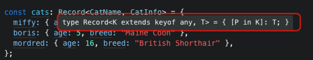

索引签名类型也被称为映射类型（Mapped types），也就是对象字面量类型。

在 JS 中我们可能会临时创建一个空的对象，在后续的操作中再添加某些属性：

```javascript
let obj = {};
obj = 1;
obj = "1";
```

在 TS 中如果我们要实现同样的做法也是可以的：

```typescript
let obj: object = {};
obj.name = "Ben"; // ❌ 类型“object”上不存在属性“name”
```

但是在 TS 中`object`类型是一个上层类型，`object`类型本身不包含任何具体的属性，它只是一个非常宽泛的类型，表示「不是基本类型的对象」。因此，TypeScript 不能识别`.b`属性，因为在类型`object`上没有定义`name`这个属性。

我们可以使用可选属性让 TS 得到类型的提示：

```typescript
type User = {
  name: string
  age?: number
  sex?: string


let obj: User = {
    name: "Ben",
    age: 18
};
  
obj.name = "admin"; // ✅
```

但是这样显得太死板了，虽然可以通过可选属性来限定有哪些属性，但是如果某些情况下属性非常的多就需要在`User`类型上继续拓展。

TS 可以使用索引签名的方式动态的添加属性：

```typescript
// 设置 User 的 key 是 string | number 类型
type User = {
    [key: string]: string | number;
};
```


::: tip

`[key: T]: U`这种写法称为索引签名，相当于通过这种简单的方式告诉 Typescript，指定的对象可能有更多的键。也就是说`key`的类型为`T`，`key`对应的值为`U`类型。

:::

在上面这个示例中，我们设置了`key`的类型必须是`string`类型，值可以是`string`或者`number`类型。也就意味着这个`User`类型的变量只能声明`string`类型的`key`，值只能是`string`或者`number`。

```typescript
const user: User = {
    name: "Ben",
    age: 18
};
user.type = "admin"; // ✅
```

上面的示例中，虽然我们在编辑器中访问属性没有任何的提示了，但是至少是可以动态的添加对象属性了，但是也丢失了安全性！

<br />

由于在 JS 中如果使用方括号访问对象的属性`user[prop]`的形式会将数字索引访问转化为字符串索引访问（例如`user[0]`转换为`user['0']`），所以在字符串索引签名类型中还可以声明`number`类型的键，`symbol`也是如此：

```typescript
const user: User = {
    name: 'hayes',
    sex: '男',
    123: '123',
    [Symbol('a')]: 'symbol'
}
```

<br />

索引签名类型也可以和具体的键值对类型声明并存，但是需要注意的是：具体的键值对类型也需要复合索引签名类型的声明：

```typescript
type User = {
    [key: string]: string
    name: string
    age: number // ❌
}
```

如果要让`age`的 key 不报错，那么就可以标注值为一个联合类型：

```typescript
type User = {
    [key: string]: string | number | symbol | undefined;
    name: string;
    age: number;
};
```

<br />

索引签名类型最常见的场景就是在重构 JS 代码的时候或者创建类型声明的时候，为内部属性较多的对象声明一个`any`类型的索引签名类型，以此来达到暂时支持对类型未明确属性的访问：

```typescript
type AnyTypeHere = {
    [key: string]: any;
};
```

<br />

TS 提供了一些工具类型，详见：[https://www.typescriptlang.org/docs/handbook/utility-types.html](https://www.typescriptlang.org/docs/handbook/utility-types.html)

其中`Record<Keys, Type>`类型的作用是将`Keys`的类型作为对象的键，`Type`的类型作为对象的值。

例如：

```typescript
interface CatInfo {
    age: number;
    breed: string;
}

type CatName = "miffy" | "boris" | "mordred";

const cats: Record<CatName, CatInfo> = {
    miffy: { age: 10, breed: "Persian" },
    boris: { age: 5, breed: "Maine Coon" },
    mordred: { age: 16, breed: "British Shorthair" }
};
```

`Record<Keys, Type>`类型的内部实际上使用的就是索引签名类型进行操作的！



