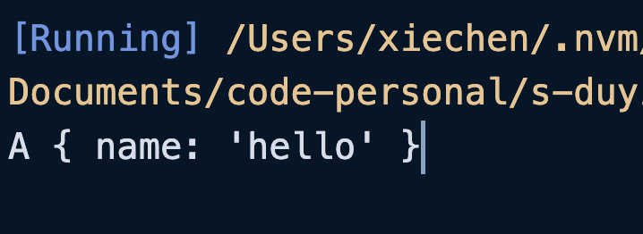

属性装饰器本身也是一个函数，只是函数的描述不同。

这个函数至少需要两个参数：

+ **<font style="background-color:#F9EFCD;">参数一：如果是类的静态属性，则该参数为类本身。如果是类的实例属性，则该参数为类的原型；</font>**
+ 参数二：`String`类型的 Key（也就是属性名）；

```typescript
function d(target: any, key: string) {
    console.log(target, key);
    // 判断 target 是否是 A 的原型对象
    console.log(target === A.prototype);
}

class A {
    @d
    prop1: string = "hello";
    @d
    static prop2: string = "world";
}
```


属性装饰器也能写成工厂模式：

```typescript
function d(value: string) {
    return function (target: any, key: string) {
        console.log(target, key);
        console.log(target === A.prototype);
    };
}

class A {
    @d("hello")
    prop1: string = "hello";
    @d('world')
    static prop2: string = "world";
}
```


由于实例属性装饰器的`target`是类的原型，如果我们给`target`添加一个属性的时候，所有的实例成员都将可以访问这个属性，如果想要给单独的实例对象设置一个属性，我们可以使用一点点策略：

```typescript
function d(value: string) {
    return function (target: any, key: string) {
        if (!target.__initProperties__) {
            // 给 target 添加一个 __initProperties__ 方法
            // 用于添加属性
            target.__initProperties__ = function () {
                for (let prop in target.__props) {
                    this[prop] = target.__props[prop];
                }
            };
            // __props 用于收集属性
            target.__props = {};
        }
        target.__props[key] = value;
    };
}

class A {
    @d("hello")
    public name: string = "zhangsan";
    constructor() {
        // 实例化的时候判断有没有 __initProperties__ 这个函数
        if (typeof this["__initProperties__"] === "function") {
            this["__initProperties__"]();
        }
    }

    @d("world")
    static age: number = 18;
}
```



