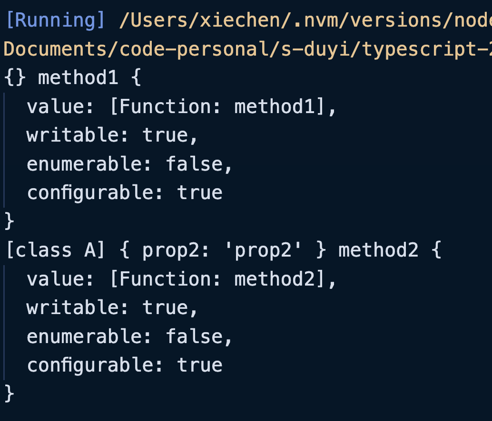

方法装饰器也是一个函数。这个函数至少需要三个参数：

+ **<font style="background-color:#F9EFCD;">参数一：如果是类的静态方法，则该参数为类本身（构造函数）。如果是类的原型方法，则该参数为类的原型对象；</font>**
+ 参数二：`String`类型的 Key，也就是方法名；
+ 参数三：属性描述对象（也就是`Object.defineProperty()`中的属性描述对象）；


示例：

```typescript
function methodDecorator1(
    target: object,
    key: string,
    descriptor: PropertyDescriptor
) {
    console.log(target, key, descriptor);
}

function methodDecorator2(
    target: new (...args: any[]) => any,
    key: string,
    descriptor: PropertyDescriptor
) {
    console.log(target, key, descriptor);
}

class A {
    prop1: string = "prop1";
    static prop2: string = "prop2";

    // 原型方法
    @methodDecorator1
    method1(): void {
        console.log("method1");
    }

    // 静态方法
    @methodDecorator2
    static method2(): void {}
}

```



通过打印的结果可以看到，无论是类的原型方法还是静态方法默认都是不可以进行遍历的，我们完全可以使用属性描述符进行更改。

```typescript
function methodDecorator1(
    target: object,
    key: string,
    descriptor: PropertyDescriptor
) {
    descriptor.enumerable = true;
    console.log(target, key, descriptor);
}

...// 仅更改原型方法，其余不变

for (const key in Object.getPrototypeOf(new A())) {
   console.log(key);
}

/*
  method1
*/
```

可以看到，打印了原型的方法名字`method1`。


这样以来我们的操作性就大大增加了，我们完全可以使用属性描述符来更改`value`的值，例如更改原来的值提示这个方法被废弃了：

```typescript
function noUse() {
    return function (target: any, key: string, descriptor: PropertyDescriptor) {
        // 替换掉原来的方法
        descriptor.value = function () {
            console.log("被废弃的方法");
        };
    };
}

class A {
    prop1: string = "";
    prop2: string = "";

    method1() {}

    @noUse()
    method2() {
        console.log("正常执行......");
    }
}

const objA = new A();
objA.method2(); // 被废弃的方法
```


同样的可以使用工厂模式：

```typescript
function noUse(flag: boolean) {
    return function (
        target: object,
        key: string,
        descriptor: PropertyDescriptor
    ) {
        if (flag) {
            descriptor.value = function () {
                console.log("被废弃的方法");
            };
        }
    };
}

class A {
    prop1: string = "prop1";
    static prop2: string = "prop2";

    @noUse(true)
    method1(): void {}
}

A.prototype.method1(); // 被废弃的方法
```

