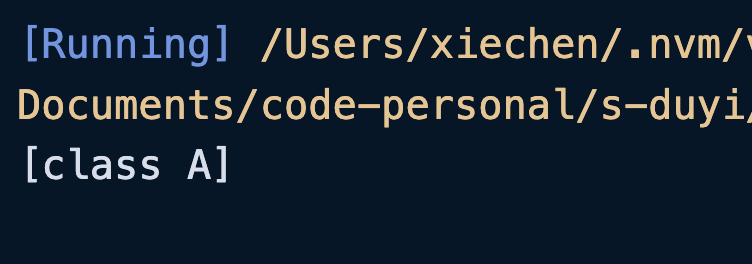

装饰器的本质就是一个函数，可以用来修饰类、属性、方法、参数。装饰器上 ESCMScript 的内容，在 TS 编译后是需要参与运行的，由于装饰器还么有成为正式的规范（2024 年），需要需要针对性的进行配置`"experimentalDecorators": true`。

<br />

上面说了，装饰器的本质就是一个函数，作为函数肯定是有参数的，当装饰器修饰类的时候，函数就只有一个参数，即类（构造函数）本身。

在 TS 中构造函数的类型我们之前也讲过，使用`new (...args:any[]) => any`表示。如果使用`Function`标注类型也可以，但是`Function`的范围太宽泛了，不推荐使用！

```typescript
function classDecorator(target: new (...args: any[]) => any) {
    console.log(target);
    target.prototype.name = "A";
}

@classDecorator
class A {}
```

<XTextLight>构造器在定义这个类的时候就会直接运行，而不用等到 `new` 实例化的时候。</XTextLight>



从打印结果就可以看到，`target`就是这个类本身。

<br />

我们也可以将`target`的类型约束抽离为一个泛型：

```typescript
type constructor<T = any> = new (...args: any[]) => T;

type User = {
    id: number;
    name: string;
    info(): void;
};

function classDecoration<T extends constructor<User>>(target: T) {
    console.log(target);
}

@classDecoration
class A {
    constructor(public id: number, public name: string) {}
    info() {}
}
```

<br />

我们说装饰器就是一个函数，函数是可以通过调用传递参数的，但是现在装饰器的第一个参数被`target`占用了，那么如何传递参数呢？

我们可以使用工厂模式解决这个问题，也就是一个函数再返回一个函数（闭包）。

```typescript
type constructor<T = any> = new (...args: any[]) => T;

function classDecorator<T extends constructor>(str: string) {
    console.log("普通方法的参数:" + str);

    // 返回出去的函数才是真正的装饰器
    return function (target: T) {
        console.log("类装饰器" + str);
    };
}

@classDecorator("hello")
class A {}
```

<br />

通过工厂模式即然可以返回一个函数，那么也可以返回一个类，我们也能通过这种方式对原来的类进行修饰：

```typescript
type constructor<T = any> = new (...args: any[]) => T;

function classDecorator<T extends constructor>(target: T) {
    // 返回一个新的类并继承 target
    return class extends target {
        public newProperty = "new property";
        public hello = "override";

        info() {
            console.log("this is info");
        }
    };
}

@classDecorator
class A {
    public hello = "hello world";
}

const objA = new A();
console.log(objA.hello); // override
console.log((objA as any).newProperty); // new property
(objA as any).info(); // this is info
```

虽然可以这么做，但是很明显，返回的新的类，并不知道有新加的内容。

<br />

装饰器不仅仅可以写一个，还可以添加多个：

```typescript
function classDecorator1<T extends new (...args: any[]) => any>(value: string) {
    return function (target: T) {
        console.log("classDecorator1" + value);
    }
}

function classDecorator2<T extends new (...args: any[]) => any>(target: T) {
    console.log("classDecorator2");
}

@classDecorator1("A")
@classDecorator2
class A {}

/*
  classDecorator2
  classDecorator1A
*/
```

<XTextLight>当使用多个装饰器的时候，是从下到上执行的！</XTextLight>