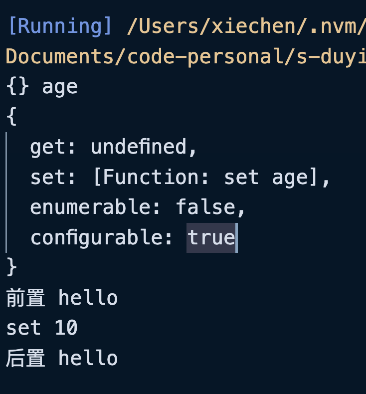
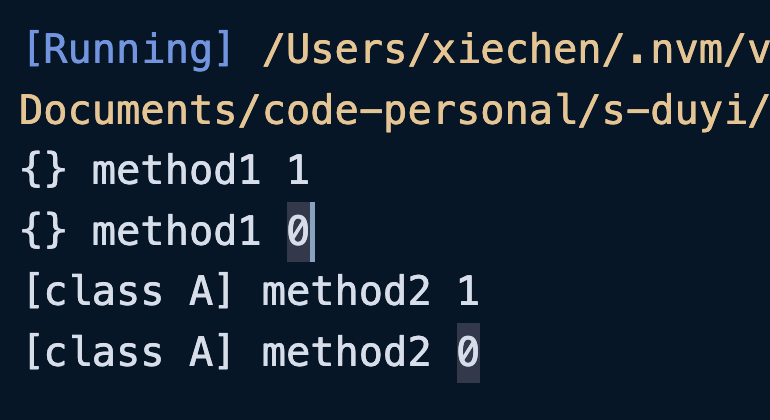

##  访问器属性装饰器
访问器属性也可以使用装饰器，装饰器函数参数如下：

+ 参数一：类的原型；

+ 参数二：`String`类型的 Key，也就是方法名；

+ 参数三：属性描述对象；

```typescript
// 工厂模式
function d(str: string) {
    return function d<T>(
        target: any,
        key: string,
        descriptor: TypedPropertyDescriptor<T>
    ) {
        console.log(target, key);
        const temp = descriptor.set!;
        descriptor.set = function (value: T) {
            console.log("前置", str);
            temp.call(this, value);
            console.log("后置", str);
        };
    };
}

class User {
    public id: number = 0;
    public name: string = "";
    private _age: number = 0;

    @d("hello")
    set age(v: number) {
        console.log("set", v);
        this._age = v;
    }
}

const u = new User();
u.age = 10;
```



::: warning

访问器属性的「属性描述对象」是没有`value`和`writable`属性的，而是使用`get`和`set`。

:::

##  方法参数装饰器

方法参数几乎和属性装饰器一致，只是多了一个属性。

+ 参数一：如果是类的静态方法的参数，该参数为类本身。如果是类的原型方法的参数，该参数为类原型；

+ 参数二：`String`类型的 Key，也就是参数名；

+ 参数三：表示参数的顺序；

```typescript
// 工厂模式
function paramDecorator(value: any) {
   return function(target: any, key: string, index: number){
    console.log(target, key, index);
   }
}

class A {
    method1(
        @paramDecorator("add") id: number, 
        @paramDecorator("point") name: string
    ) {
        console.log("---method1---", id, name);
    }

    static method2(
        @paramDecorator("add") id: number, 
        @paramDecorator("point") name: string
    ){
        console.log("method2");
        console.log("---method2---", id, name);
    }
}

const objA = new A();
```



