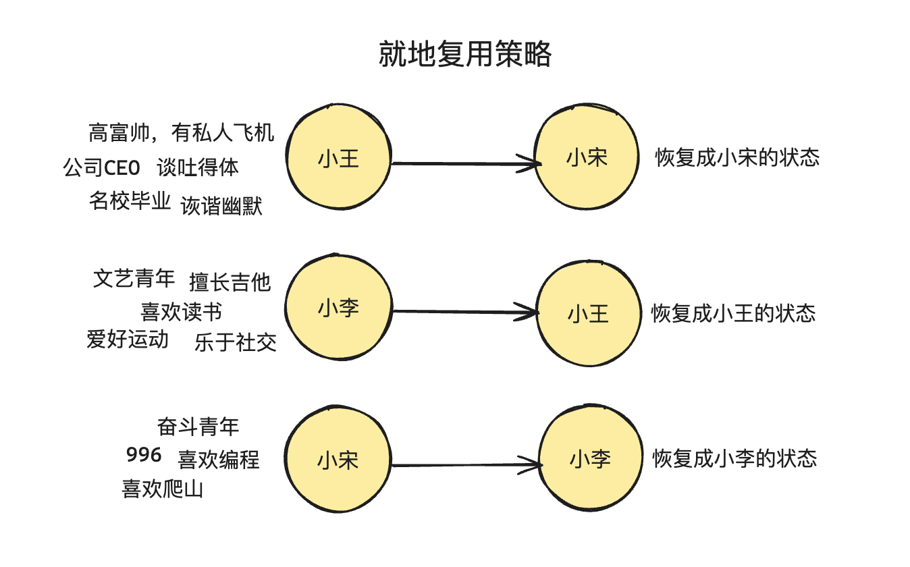

# Key 的本质

在关系型数据库中，有一个 primary key 的概念，这个其实和 Vue 中的 Key 具有一定的相似性。


在关系型数据库中，primary key 用于标记某条数据的唯一性，因此在上面的表格中只有 id 这个字段能够作为主键，另外 3 个字段都不可以。

为什么需要对一条数据进行唯一性的标识呢？

<XTextLight>那就是方便精确的查找。</XTextLight> 这就好比现实生活中的身份证号，所有的人都是独一无二的，人的名字、年龄、性别这些可能是相同的，但是身份证号是每个人唯一的标识，这样就能够精准的找到某个人。

<XTextLight>在 Vue 中，Key 属性也是同样的作用，是用来对 VNode 虚拟节点进行唯一性的标识。</XTextLight>

## 不采用复用策略

假如更新之前的虚拟 DOM 为：

```javascript
const oldVNode = {
  type: 'div',
  children: [
    {type: 'p', children: '1'},
    {type: 'p', children: '2'},
    {type: 'p', children: '3'},
  ]
}
```

```html
<div>
  <p>1</p>
  <p>2</p>
  <p>3</p>
</div>
```

<br />

更新之后的虚拟 DOM 为：

```javascript
const newVNode = {
  type: 'div',
  children: [
    {type: 'p', children: '4'},
    {type: 'p', children: '5'},
    {type: 'p', children: '6'},
  ]
}
```

根据上面的代码可以看出，两组虚拟 DOM 对比其实只有 1、2、3 变为了 4、5、6，如果不采用复用策略，那么当更新子节点的时候，就需要执行 6 次 DOM 操作。

- 卸载所有旧的子节点，需要 3 次 DOM 删除操作；

- 挂载所有新的子节点，需要 3 次 DOM 创建操作；


而实际上仅仅是`<p>`元素的子节点（文本节点）发生变化，`<p>`元素本身其实没有任何的变化。所以最理想的方式就是只更新这 3 个文本节点的内容，这样只涉及到 3 次 DOM 操作，性能提升一倍。

## 采用复用策略

1、先考虑更新前后长度不变、类型不变的情况。

这里可以写出如下的伪代码：

```javascript
// n1 是旧的 VNode
// n2 是新的 VNode
function patchChildren(n1, n2, container){
  if(typeof n2.children === 'string'){
    // 说明该节点的子节点就是文本节点
    // ...
  } else if(Array.isArray(n2.children)){
    // 说明该节点的子节点也是数组
    const oldChildren = n1.children; // 旧的子节点数组
    const newChildren = n2. children; // 新的子节点数组
    
    // 目前假设长度没有变化
    for(let i = 0; i < oldChildren.length; i++){
      // 对文本子节点进行更新
      patch(oldChildren[i], newChildren[i])
    }
  } else {
    // 其他情况
    // ...
  }
}
```

<br />

2、考虑长度发生变化的情况。

- 对于新节点更多的情况，那就需要挂载新的节点，旧节点保持不变进行复用。


+ 对于新节点变少的情况，那就需要卸载多余的旧节点，旧节点保持不变进行复用。


所以，我们的伪代码发生一点变化：

```javascript
function patchChildren(n1, n2, container){
  if(typeof n2.children === 'string'){
    // 说明该节点的子节点就是文本节点
    // ...
  } else if(Array.isArray(n2.children)){
    // 说明该节点的子节点也是数组
    const oldChildren = n1.children; // 旧的子节点数组
    const newChildren = n2. children; // 新的子节点数组
    
    // 存储一下新旧节点的长度
    const oldLen = oldChildren.length; // 旧子节点数组长度
    const newLen = newChildren.length; // 新子节点数组长度
    
    // 接下来先找这一组长度的公共值，也就是最小值
    const commonLength = Math.min(oldLen, newLen);
    
    // 先遍历最小值，把该处理的节点先更新
    for(let i = 0; i < commonLength; i++){
      // 对文本子节点进行更新
      patch(oldChildren[i], newChildren[i])
    }
    
    // 然后接下来处理长度不同的情况
    if(newLen > oldLen){
      // 新节点多，那么就做新节点的挂载
      for(let i = commonLength; i < newLen; i++){
        patch(null, newChildren[i], container);
      }
    } else if(oldLen > newLen){
      // 旧节点多，做旧节点的卸载
      for(let i = commonLength; i < oldLen; i++){
        unmount(oldChildren[i]);
      }
    }
  } else {
    // 其他情况
    // ...
  }
}
```

<br />

3、考虑类型发生变化的情况

例如旧节点：

```javascript
const oldVNode = {
  type: 'div',
  children: [
    {type: 'p', children: '1'},
    {type: 'div', children: '2'},
    {type: 'span', children: '3'},
  ]
}

```

新节点：

```javascript
const newVNode = {
  type: 'div',
  children: [
    {type: 'span', children: '3'},
    {type: 'p', children: '1'},
    {type: 'div', children: '2'},
  ]
}

```

按照上面的结构，当遇到类型不一致的情况，通通不能进行复用，这样又回到了最初的情况，需要 6 次的 DOM 操作。

但是我们稍作观察就会发现，上面的示例中仅仅是元素移动了位置，所以最理想的情况是移动一下 DOM 的位置即可，这样就能够达到对 DOM 节点的复用。

那么如何来确定是同一个类型能够复用的节点呢？

如果仅仅是判断 VNode 的`type`属性是否相同，这种方式并不可靠！

```javascript
const oldVNode = {
  type: 'div',
  children: [
    {type: 'p', children: '3'},
    {type: 'div', children: '2'},
    {type: 'p', children: '1'},
  ]
}
```

```javascript
const newVNode = {
  type: 'div',
  children: [
    {type: 'p', children: '1'},
    {type: 'p', children: '3'},
    {type: 'div', children: '2'},
  ]
}
```

`{type: 'p', children: '3'}`和`{type: 'p', children: '1'}`明显是不能进行复用的！

这种情况下，没有办法很好的有一个正确的对应关系，因为有很多相同类型的节点。


### 添加 Key 标识

Key 相当于给每一个 VNode 添加一个身份证号，通过这个身份证号就可以找到唯一的那个 VNode，而不是多个。

```javascript
const oldVNode = {
  type: 'div',
  children: [
    {type: 'p', children: '3', key: 1},
    {type: 'div', children: '2', key: 2},
    {type: 'p', children: '1', key: 3},
  ]
}
```

```javascript
const newVNode = {
  type: 'div',
  children: [
    {type: 'p', children: '1', key: 3},
    {type: 'p', children: '3', key: 1},
    {type: 'div', children: '2', key: 2},
  ]
}
```

有了 Key 之后就可以精准的进行匹配了。


在实际的判断中，如果 VNode 的`type`属性和`key`属性都一致，那么就说明是同一个 DOM 对象，并且在新旧节点中都出现了，那么就可以直接进行复用了。

<br />

那么如果没有 Key，在旧的节点中找到一个类型相同的节点，直接进行复用，这样的设计不行吗？

<XTextLight>实际上在没有 Key 的情况下，Vue 内部采用的就是这样的策略，这种策略在 Vue 中被称为「就地更新策略」。</XTextLight>

这种策略默认是高效的，但是这种复用策略仅仅是保证 DOM 节点类型能够正确匹配，如果节点本身还依赖子组件状态或者临时 DOM 的状态，由于这种复用策略没有精确的对上号，因此会涉及到子组件状态或者临时 DOM 状态的还原。

<br />

举个例子，假如旧节点是三个男生，新节点也是三个男生：


如果不考虑其他的因素，只考虑是否是男生，然后简单的把名字换一下，那么这种复用策略是非常高效的。

但是很多时候依赖子组件状态或者临时 DOM 状态：



这样就会导致了“小王”的高富帅状态一下子就变成了“小宋”打工人的状态，所以这种复用策略反而是低效的，因为涉及到子组件状态或者临时的 DOM 状态的恢复。

因此在这个时候，最好的方式就是加上 Key，让新旧节点能够精准的对应上。


<br />

:::tip
还有一点需要注意，那就是避免使用 Index 下标作为 Key 值。使用下标作为 Key 值的时候，如果列表中的元素顺序发生了变化，Vue 会复用错误的元素，导致不必要的 DOM 更新和渲染渲染错误。
:::

例如，当你在列表中插入或者删除元素的时候，使用下标会使的每个元素的 Key 都发生变化，导致 Vue 不能正确识别元素，从而导致状态和数据的不一致。

```javascript
// 初始状态
[{ id: 1, text: 'Item 1' }, { id: 2, text: 'Item 2' }, { id: 3, text: 'Item 3' }]

// 删除第二个元素后的状态
[{ id: 1, text: 'Item 1' }, { id: 3, text: 'Item 3' }]
```

在这种情况下，如果使用 Index 下标作为 Key 值，当删除第二个元素后，第三个元素的下标会从 2 变成 1，这会使 Vue 误认为原本的第三个元素和第二个元素是同一个，从而导致错误的更新。

## 总结

Key 的本质就是给 VNode 节点添加一个唯一性的标识，算是 VNode  的一个身份证号。

特别是渲染列表的时候，Key 具有以下几个点：

1、高效的更新：Key 帮助 Vue 识别哪些元素是变化的、哪些是新的、哪些是需要被移除的。

- 在没有 Key 的情况下，Vue 会尽量复用已有元素，而不管它们的实际内容是否发生了变化，这可能导致不必要的更新或者错误的更新；

- 通过使用 Key，Vue 可以精确的知道哪些元素发生了变化，从而高效的更新 DOM；

2、确保元素的唯一性：Key 属性需要唯一的，这样每个元素在列表中都可以被唯一标识。这避免了在元素移动、插入或删除时候出现的混淆，确保 Vue 可以正确的追踪每个元素。

3、提升渲染性能：使用 Key 可以显著提升列表的渲染性能。因为 Vue 能够通过 Key 快速定位到需要更新的元素，而不是重新渲染整个列表。尤其是在处理大型列表的时候，使用 Key 可以避免大量不必要的 DOM 操作，提升应用的响应速度。