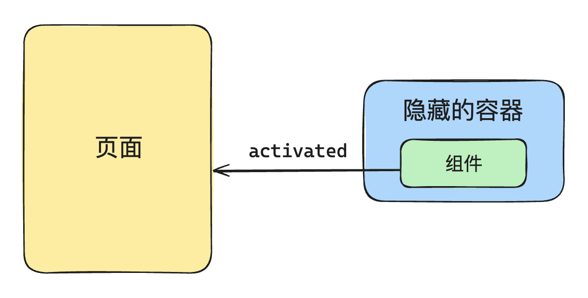

# keep-alive 生命周期

## 基本使用

`<keep-alive>`是 Vue 中的一个内置组件，该组件用于缓存组件的实例，避免组件被频繁的销毁/重建，从而提高性能。

使用示例：

```vue
<template>
	<Tab v-if="currentTab === 1">...</Tab>
	<Tab v-if="currentTab === 2">...</Tab>
	<Tab v-if="currentTab === 3">...</Tab>
</template>
```

以上代码中会根据`currentTab`属性的值来切换不同的`<Tab>`组件。如果用户不停的频繁的更改`currentTab`属性的值就会导致`<Tab>`组件不停的卸载并重建组件。

如果使用了`<keep-alive>`组件就可以避免这个问题：

```vue
<template>
	<keep-alive>
  	    <Tab v-if="currentTab === 1">...</Tab>
		<Tab v-if="currentTab === 2">...</Tab>
		<Tab v-if="currentTab === 3">...</Tab>	
  </keep-alive>
</template>
```

<br />

当我们使用了`<keep-alive>`组件后，当组件被激活或挂起的时候不会触发`mounted()`、`unmounted()`钩子函数，而是会触发`activated()`、`deactivated()`这两个钩子方法。

- `activated`：首次挂载，以及组件激活时触发；

- `deactivated`：组件卸载，以及组件失活时触发；

## `<keep-alive>` 的本质

<u>`<keep-alive>`组件的实现需要 Vue 渲染器层面的支持当组件需要卸载的时候不能真正的卸载，否则就无法维护组件的状态了。</u>

所以正确的做法应该是：将需要缓存的组件搬运到一个隐藏的容器里面，从而实现“假卸载”。


等被缓存的组件需要重新挂载的时候，也是直接从隐藏的容器里面再次搬运到原来的容器。



这个过程就是我们前面说的两个生命周期函数：`activated`、`deactivated`。

<br />

一个最基本的`<keep-alive>`组件实现起来并不复杂，代码如下：

```javascript{15,23,26,47,54,56}
const KeepAlive = {
  // 这是 keepalive 组件独有的属性，用于标识这是一个 keepalive 组件
  __isKeepAlive: true,
  
  setup(props, { slots }) {
    // 这是一个缓存对象
    // key：vnode.type
    // value: vnode
    const cache = new Map()
    
    // 存储当前 keepalive 组件的实例
    const instance = currentInstance;
    
    // 这里从组件实例上面解构出来两个方法，这两个方法实际上是由渲染器注入的
    const { move, createElement } = instance.keepAliveCtx;

    // 创建隐藏容器
    const storageContainer = createElement("div");

    // 这两个方法所做的事情，就是将组件从页面和隐藏容器之间进行移动
    // 这两个方法在渲染器中会被调用
    instance._deActivate = (vnode) => {
      move(vnode, storageContainer);
    };
    instance._activate = (vnode, container, anchor) => {
      move(vnode, container, anchor);
    };


    return () => {
      // 获取到默认插槽里面的内容
      let rawVNode = slots.default();

      // 如果不是对象，说明是非组件的虚拟节点，直接返回
      if (typeof rawVNode.type !== "object") {
        return rawVNode;
      }

      // 接下来我们从缓存里面找一下，看当前的组件是否存在于缓存里面
      const cachedVNode = cache.get(rawVNode.type);

      if (cachedVNode) {
        // 缓存中存在
        // 如果缓存中存在，直接使用缓存的组件实例
        rawVNode.component = cachedVNode.component;
        // 并且挂上一个 keptAlive 属性
        rawVNode.keptAlive = true;
      } else {
        // 缓存中不存在
        // 那么就添加到缓存里面，方便下次使用
        cache.set(rawVNode.type, rawVNode);
      }
      // 接下来又挂了一个 shouldKeepAlive 属性
      rawVNode.shouldKeepAlive = true;
      // 将 keepalive 组件实例也添加到 vnode 上面，后面在渲染器中有用
      rawVNode.keepAliveInstance = instance;
      return rawVNode;
    };
  },
};
```

::: tip
`<keep-alive>`和渲染器是结合的比较深的。`<keep-alive>`组件本身不会渲染额外的什么内容，它的渲染函数最终只会返回需要被缓存的组件，这样的组件我们称作为“内部组件”。
:::

`<keep-alive>`组件会被内部的组件添加一些标记属性，以方便渲染器能够根据这些标记属性执行一些特定的逻辑。

- `rawVNode.keptAlive`属性：标识内部组件已经被缓存了，这样当内部组件需要重新渲染的时候，渲染器就不会重新挂载它，而是将其进行激活。

```javascript{20-21}
// 渲染器内部代码片段
function patch(n1, n2, container, anchor) {
  if (n1 && n1.type !== n2.type) {
    unmount(n1);
    n1 = null;
  }

  const { type } = n2;

  if (typeof type === "string") {
    // 省略部分代码
  } else if (type === Text) {
    // 省略部分代码
  } else if (type === Fragment) {
    // 省略部分代码
  } else if (typeof type === "object" || typeof type === "function") {
    // component
    if (!n1) {
      // 如果该组件已经被 KeepAlive，则不会重新挂载它，而是会调用_activate 来激活它
      if (n2.keptAlive) {
        n2.keepAliveInstance._activate(n2, container, anchor);
      } else {
        mountComponent(n2, container, anchor);
      }
    } else {
      patchComponent(n1, n2, anchor);
    }
    
  }
}

```

- `rawVNode.shouldKeepAlive`属性：该属性会被添加到 VNode 上面，这样当渲染器卸载内部组件的时候，不会真正的去卸载，而是将其隐藏到容器里面。

```javascript{8,11}
// 渲染器代码片段
function unmount(vnode) {
  if (vnode.type === Fragment) {
    vnode.children.forEach((c) => unmount(c));
    return;
  } else if (typeof vnode.type === "object") {
    // vnode.shouldKeepAlive 是一个布尔值，用来标识该组件是否应该 KeepAlive
    if (vnode.shouldKeepAlive) {
      // 对于需要被 KeepAlive 的组件，我们不应该真的卸载它，而应调该组件的父组件，
      // 即 KeepAlive 组件的 _deActivate 函数使其失活
      vnode.keepAliveInstance._deActivate(vnode);
    } else {
      unmount(vnode.component.subTree);
    }
    return;
  }
  const parent = vnode.el.parentNode;
  if (parent) {
    parent.removeChild(vnode.el);
  }
}

```

- `rawVNode.keepAliveInstance`属性：该属性让内部组件持有`<keep-alive>`的组件实例，回头在渲染器中的某些场景下可以通过这个属性访问`<keep-alive>`的组件实例上面的`_deActivate`以及`_activate`。

## include 和 exclude 属性

默认情况下，`<keep-alive>`组件会对所有的“内部组件”进行缓存。

不过某些时候用户只希望缓存特定的组件，此时可以使用`include`和`exclude`属性。

```vue
<keep-alive include="TextInput,Counter">
  <component :is="Component" />
</keep-alive>
```

<br />

因此，`<keep-alive>`组件需要定义相关的`props`:

```javascript
const KeepAlive = {
  __isKeepAlive: true,
  props: {
    include: RegExp, // 支持多种类型，这里只举例正则的情况
    exclude: RegExp
  },
  setup(props, { slots }) {
    // ...
  }
};
```

<br />

有了这两个属性后，在进入缓存之前，`<keep-alive>`组件需要对内部组件是否匹配进行判断：

```javascript{4-5,17-21}
const KeepAlive = {
  __isKeepAlive: true,
  props: {
    include: RegExp,
    exclude: RegExp,
  },
  setup(props, { slots }) {
    // 省略部分代码...

    return () => {
      let rawVNode = slots.default();
      if (typeof rawVNode.type !== "object") {
        return rawVNode;
      }

      const name = rawVNode.type.name;
      if (
        name &&
        ((props.include && !props.include.test(name)) ||
          (props.exclude && props.exclude.test(name)))
      ) {
        return rawVNode;
      }

      // 进入缓存的逻辑...
    };
  },
};

```

## 缓存管理

目前为止的缓存实现如下：

```javascript
// 从缓存里面找一下，看当前的组件是否存在于缓存里面
const cachedVNode = cache.get(rawVNode.type);

if (cachedVNode) {
  // 如果缓存中存在，直接使用缓存的组件实例
  rawVNode.component = cachedVNode.component;
  // 并且挂上一个 keptAlive 属性
  rawVNode.keptAlive = true;
} else {
  // 缓存中不存在
  // 那么就添加到缓存里面，方便下次使用
  cache.set(rawVNode.type, rawVNode);
}
```

只要缓存不存在，那么就会设置新的缓存，这就会导致缓存不断的增加，极端的情况下会占用大量的内容。

为了解决这个问题，`<keep-alive>`组件允许用户设置最大缓存数的阈值，当组件缓存数量超过了指定的阈值后就会对缓存列表进行修剪。

```vue
<keep-alive :max="3">
  <component :is="Component" />
</keep-alive>
```

因此在设计`<keep-alive>`组件的时候，新增一个`max`的`props`：

```javascript{6}
const KeepAlive = {
  __isKeepAlive: true,
  props: {
    include: RegExp,
    exclude: RegExp,
    max: Number
  },
  setup(props, { slots }) {
    // ...
  }
};
```

接下来需要一个能够修剪缓存的方法：

```javascript
function pruneCacheEntry(key: CacheKey) {
  const cached = cache.get(key) as VNode
  
  // 中间逻辑略...
  
  cache.delete(key)
  keys.delete(key)
}
```

然后是更新缓存队列：

```javascript{8-9,12-13,15}
const cachedVNode = cache.get(key)
if (cachedVNode) {
  // 其他逻辑略...
 
  // 进入此分支，说明缓存队列里面有，有的话就更新一下顺序
  // 保证当前这个在缓存中是最新的
  // 先删除，再添加即可
  keys.delete(key)
  keys.add(key)
} else {
  // 说明缓存中没有，说明是全新的，先添加再修剪
  keys.add(key)
  if (max && keys.size > parseInt(max as string, 10)) {
    // 进入此分支，说明当前添加进去的组件缓存已经超过了最大值，进行删除
    pruneCacheEntry(keys.values().next().value)
  }
}
```

## 总结

最后对本篇文章进行一个总结：

- `<keep-alive>`组件的核心原理就是将内部组件搬运到一个隐藏的容器里，以及从隐藏的容器里搬运回来。因为没有涉及到真正的卸载，所以组件的状态也会得到保留。

- `<keep-alive>`和渲染器是结合比较深的，`<keep-alive>`会给内部组件添加一些特殊的标识，这些标识就是专门提供给渲染器使用的，回头渲染器在挂载和卸载组件的时候，会根据这些标识执行特定的操作。

- `include`和`exclude`核心原理就是对内部组件进行一个匹配的操作，匹配成功后在进入后面的缓存逻辑。

- `max`属性就是在添加缓存之前看一下缓存队列中有没有缓存过该组件。

    - 缓存过：更新到队列的最后。

    - 没有缓存过：加入缓存里面，但是要看一下没有有超过最大值，超过了就需要进行修剪。