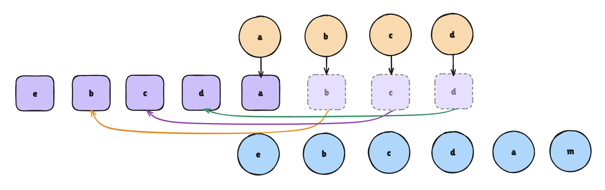

# 快速 Diff

回顾一下双端 Diff 的执行过程：

+ 头头对比；

+ 尾尾对比；

+ 头尾对比；

+ 尾头对比；

+ 暴力对比；

这种对比策略其实会存在额外的移动操作：



+ 对于 e 节点匹配不到，则会创建 e 节点对应的 DOM 节点，并放在旧头对应的 DOM 节点之前；

+ 对于 b 节点，通过暴力对比是可以找到的，将 b 节点对应的 DOM 移动到旧头对应的 DOM 节点之前；

+ 依次类推，c 和 d 节点所对应的 DOM 节点都会进行移动操作；

<br />

双端 Diff 的问题就是会频繁的移动 DOM，可实际的现象是在新旧节点列表中 b、c、d 这几个节点的顺序是一致的，不需要进行移动，只需要移动 a 节点对应的 DOM 到 d 节点对应的 DOM 之后即可。

<br />

Vue3 的快速 Diff 对上面的步骤进行了优化，大致如下：

+ 头头对比

+ 尾尾对比

+ 非复杂情况处理

+ 复杂情况处理

<br />

可以看到快速 Diff 和双端 Diff 也存在一些相同的步骤，我们重点看一下不同的情况。

## 和双端不同的步骤

经历了头头对比，尾尾对比后，新旧节点列表都有剩余，之后的步骤就和双端 Diff 不一样：

1. 初始化`keyToNewIndexMap`；

2. 初始化`newIndexToOldIndexMap`；

3. 更新`newIndexToOldIndexMap`；

4. 计算最长递增子序列；

5. 移动和挂在节点；

### 1、初始化 keyToNewIndexMap

首先定义了一个用户保存「新节点下标的容器`keyToNewIndexMap`」，它的形式是`key - index`，遍历还未处理的新节点，<XTextLight>将它们的 Key 和下标的映射关系存储到`keyToNewIndexMap`中。</XTextLight>

```javascript
const keyToNewIndexMap = new Map();

for (let i = newStartIdx; i <= newEndIdx; i++) {
  const key = newChildren[i].key;
  keyToNewIndexMap.set(key, i);
}

// 形式：Map{ key => index, key => index }
```

示意图：


总结，`keyToNewIndexMap`存储的就是所有「未处理」的「新节点」的 Key 和 Index 的映射关系。

### 2、初始化 newIndexToOldIndexMap

<XTextLight>接着定义了一个和未处理新节点长度一致的 `newIndexToOldIndexMap`数组，默认每一项都是 0。</XTextLight>

```javascript
const toBePatched = newEndIdx - newStartIdx + 1; // 计算没有处理的新节点的个数
const newIndexToOldIndexMap = new Array(toBePatched).fill(0);

// 形式: [0, 0, 0, 0, 0, 0]
```

示意图：


之所以一开始都初始化为 0，就是为了一开始假设所有的新节点都不存在于旧节点列表中，之后再对这个数组进行更新，如果更新完之后某项还是 0，那就表示这一位对应的新节点在旧节点中不存在。

### 3、更新 newIndexToOldIndexMap

遍历所有未处理的「旧节点」，查询旧节点在新节点中的位置，决定是更新、删除还是移动；

+ 遍历未处理的旧节点（从`oldStart`到`oldEnd`）;

+ 对于每个旧节点，执行下面的操作：

    - 查找对应的新节点索引`newIndex`：

        * 如果旧节点有 Key，通过`keyToNewIndexMap`获取`newIndex`;

        * 如果没有 Key，需要遍历新节点列表，找到第一个与旧节点相同的节点；

    - 判断节点是否存在新节点列表：
        * 如果`newIndex`没有找到，说明旧节点已经被删除了，需要卸载；

        * 如果`newIndex`找到了，说明节点需要进行保留，执行下面的操作：

            + 更新节点，调用`patch()`函数更新节点内容；

            + 记录映射关系：「将旧节点的索引加一」记录到`newIndexToOldIndexMap[newIndex - newStartIdx]`中；

            - 标记节点是否需要移动：通过比较当前的遍历顺序和`newIndex`，初步判断节点是否需要移动；

:::tip
为什么需要将旧节点的索引加一在进行存储呢？

因为前面说过，初始化`newIndexToOldIndexMap`这个数组的时候，默认的项都是 0，0 就表示这个新节点在旧节点中不存在。如果直接按照索引进行存储，并且这个旧节点的索引正好是 0，那么此时就会造成混乱，无法区分索引值还是初始化的值。
:::

示例代码：

```javascript
let moved = false;
let maxNewIndexSoFar = 0;

for (let i = oldStartIdx; i <= oldEndIdx; i++) {
  const oldNode = oldChildren[i];
  let newIndex;
  
  if (oldNode.key != null) {
    // 旧节点存在 key，根据 key 找到该节点在新节点列表里面的索引值
    newIndex = keyToNewIndexMap.get(oldNode.key);
  } else {
    // 遍历新节点列表匹配
  }
  
  if (newIndex === undefined) {
    // 旧节点在新节点中不存在，卸载
  } else {
    // 更新节点
    patch(oldNode, newChildren[newIndex], container);
    // 记录映射关系，注意这里在记录的时候，旧节点的索引要加 1
    newIndexToOldIndexMap[newIndex - newStartIdx] = i + 1;
    
    // 判断是否需要移动
    if (newIndex >= maxNewIndexSoFar) {
      maxNewIndexSoFar = newIndex;
    } else {
      moved = true;
    }
  }
}
```

<br />

详细步骤：

+ `i=0`：`[0, 0, 0, 0, 1, 0]`；

+ `i=1`：`[0, 2, 0, 0, 1, 0]`；

+ `i=2`：`[0, 2, 3, 0, 1, 0]`；

+ `i=3`：`[0, 2, 3, 4, 1, 0]`；


经过遍历旧节点列表这一操作之后，`newIndexToOldIndexMap`列表就被更新了，里面存储了每个新节点在在旧节点列表中的位置。不过需要注意的是，这个索引位置是 +1 的，更新后如果某一项依然 0，说明这个新节点在旧节点中是存在的。

<br />

以上代码判断中还存在一个移动的判断：

```javascript
// 判断是否需要移动
if (newIndex >= maxNewIndexSoFar) {
  maxNewIndexSoFar = newIndex;
} else {
  moved = true;
}

```

`maxNewIndexSoFar`是用于判断节点的相对顺序是否保存递增，然后决定是否需要移动节点。

+ 如果当前新节点的索引大于等于`maxNewIndexSoFar`，则更新`maxNewIndexSoFar`，节点的相对顺序正确，不需要标记移动；

+ 如果小于，说明节点相对顺序发生了变化，则标记移动，后续根据 LIS（最长递增子序列）决定是否移动节点；

### 4、计算最长递增子序列

首先先补充一下什么是「最长递增子序列」。

简单来说，就是在一个给定的数字序列中，找到一个最长的子序列，使得这个子序列中的数字是递增的。

我们把这个词进行拆分：最长、递增、子序列。

+ 最长：很好理解就是求最长的；

+ 递增：就是必须是从小到大排序的，递增并不要求元素在原始序列中相邻，只需要按从小到大的顺序排列即可；

+ 子序列：就是说必须是原数组中的子序列；

    - `[10, 9, 2, 5, 3, 7, 101, 18]` ==> `[10, 9]`

    - `[10, 9, 2, 5, 3, 7, 101, 18]` ==> `[2, 5, 3]`

    - 这些都是子序列；

<XTextLight>因此，最长递增子序列就是在一个数组中求出「从小到大排序的子序列中最长的一个」！</XTextLight>

<br />
<br />

我们使用下面这个数组进行举例：

```javascript
// 原始数组
[10, 9, 2, 5, 3, 7, 101, 18]

// 递增子序列，长度为 4
[2, 3, 7, 101]

// 递增子序列，长度为 3
[5, 7, 101]

...

// 所以，最长递增子序列就是 [2, 3, 7, 101]
```

下面我们回到第 4 步：计算最长递增子序列。

<br />

通过 LIS（最长递增子序列，下文将进行简写），可以确定哪些节点的相对顺序是没有改变的，可以减少需要移动的节点的数量。如果在前面的步骤中标记了`moved = true`，说明有节点需要移动，使用`newIndexToOldIndexMap`来计算出最长递增子序列`increasingNewIndexSequence`。

```javascript
const increasingNewIndexSequence = moved ? getSequence(newIndexToOldIndexMap) : [];
```

<br />

上一步中我们得到的`newIndexToOldIndex`为`[0, 2, 3, 4, 1, 0]`，之后得到的最长递增子序列为`[1, 2, 3]`。

:::tip
Vue3 内部在计算最长递增子序列的时候，返回的是原始对应的索引值。

`2, 3, 4` ==> `1, 2, 3`

因为之前更改`newIndexToOldIndex`数组的时候，索引是 +1 的，这样计算出的结果就正好抵消了前面 +1 的操作，得到了真正的索引数组。
:::


### 5、移动和挂载节点

根据计算的结果，对需要进行移动和新建的节点进行处理，「倒序遍历」未处理的新节点。

:::tip
为什么是倒序遍历呢？

因为后续的节点的位置是已经确定的，通过倒序的方式能够避免锚点引用的时候不会出错。

锚点引用是指作为节点移动的参照物。
:::

详细步骤：

+ `i = 5`

    - 锚点 DOM：`null`；

    - 创建 m 对应的真实 DOM 挂载到最后；

+ `i = 4`
    - 锚点 DOM：m 对应的真实 DOM；

    - 判断`newIndexToOldIndexMap[4]`是否为 0，如果不是说明在旧节点列表中是存在的，可以进行复用；

    - 查看`i`是否在最长递增子序列中，如果不在序列中，那么就涉及到了移动，移动到锚点 DOM 之前；

+ `i = 3`

    - 锚点 DOM：a 对应的真实 DOM；

    - 查看`newIndexToOldIndexMap[3]`不为 0，说明旧节点列表中是存在的，可以进行复用；

    - 查看`i`是否在最长递增子序列中，如果存在则不进行任何的操作；

+ `i = 2`

    - 锚点 DOM：d 对应的真实 DOM；

    - 查看`newIndexToOldIndexMap[2]`不为 0，说明旧节点列表中是存在的，可以进行复用；

    - 查看`i`是否在最长递增子序列中，如果存在则不进行任何的操作；

+ `i = 1`

    - 锚点 DOM：c 对应的真实 DOM；

    - 查看`newIndexToOldIndexMap[1]`不为 0，说明旧节点列表中是存在的，可以进行复用；

    - 查看`i`是否在最长递增子序列中，如果存在则不进行任何的操作；

+ `i = 0`

    - 锚点 DOM：b 对应的真实 DOM；

    - 查看`newIndexToOldIndexMap[0]`为 0，说明旧节点列表中是不存在的；

    - 创建新的 DOM 节点，插入到锚点 DOM 节点之前；

<br />

经过上面的过程：

+ e：新建并且插入到 b 之前

+ b： 位置不变，没有做移动操作

+ c：位置不变，没有做移动操作

+ d：位置不变，没有做移动操作

+ a：移动到 m 之前

+ m：新建并且插入到末尾


<br />

整个 Diff 下来，DOM 操作仅仅有 1 次移动，2 次新建。做到了最小化对 DOM 的操作，没有一次操作是多余的。